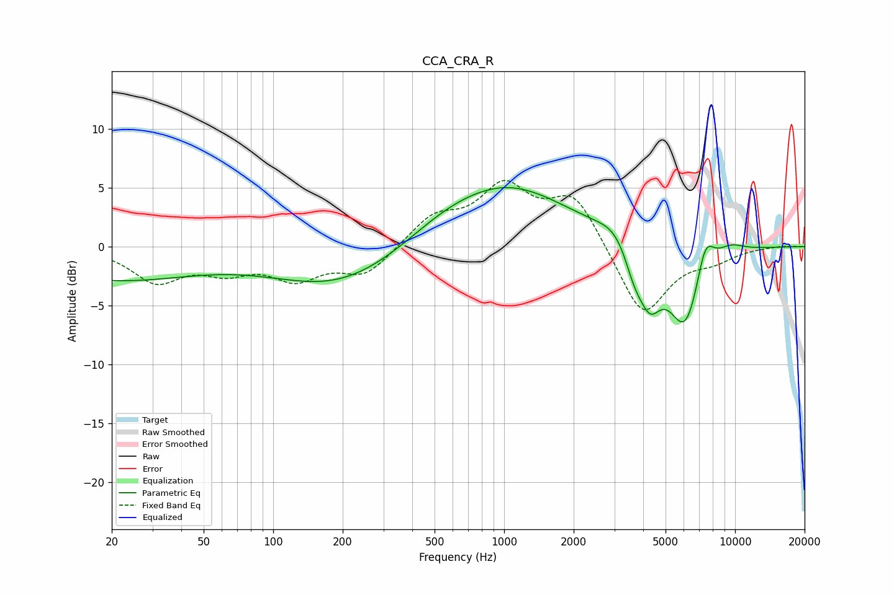

# CCA_CRA_R
See [usage instructions](https://github.com/jaakkopasanen/AutoEq#usage) for more options and info.

### Parametric EQs
Apply preamp of -5.1 dB when using parametric equalizer.

|   # | Type    |   Fc (Hz) |    Q |   Gain (dB) |
|-----|---------|-----------|------|-------------|
|   1 | Peaking |        20 | 0.38 |        -2.8 |
|   2 | Peaking |       192 | 0.5  |        -3.4 |
|   3 | Peaking |       532 | 0.9  |         0.7 |
|   4 | Peaking |      1011 | 0.51 |         5.2 |
|   5 | Peaking |      3101 | 1.84 |         1.4 |
|   6 | Peaking |      3656 | 3.08 |        -2.4 |
|   7 | Peaking |      4283 | 2.89 |        -3.9 |
|   8 | Peaking |      6095 | 1.81 |        -7.2 |
|   9 | Peaking |      7420 | 3.42 |         3.4 |
|  10 | Peaking |      9481 | 1.97 |         0.9 |

### Fixed Band EQs
When using fixed band (also called graphic) equalizer, apply preamp of **-5.7 dB** (if available) and set gains manually with these parameters.

|   # | Type    |   Fc (Hz) |    Q |   Gain (dB) |
|-----|---------|-----------|------|-------------|
|   1 | Peaking |        31 | 1.41 |        -2.8 |
|   2 | Peaking |        62 | 1.41 |        -1.7 |
|   3 | Peaking |       125 | 1.41 |        -2.4 |
|   4 | Peaking |       250 | 1.41 |        -2.3 |
|   5 | Peaking |       500 | 1.41 |         2.4 |
|   6 | Peaking |      1000 | 1.41 |         4.7 |
|   7 | Peaking |      2000 | 1.41 |         4.3 |
|   8 | Peaking |      4000 | 1.41 |        -6.1 |
|   9 | Peaking |      8000 | 1.41 |        -0.9 |
|  10 | Peaking |     16000 | 1.41 |         0.1 |

### Graphs

