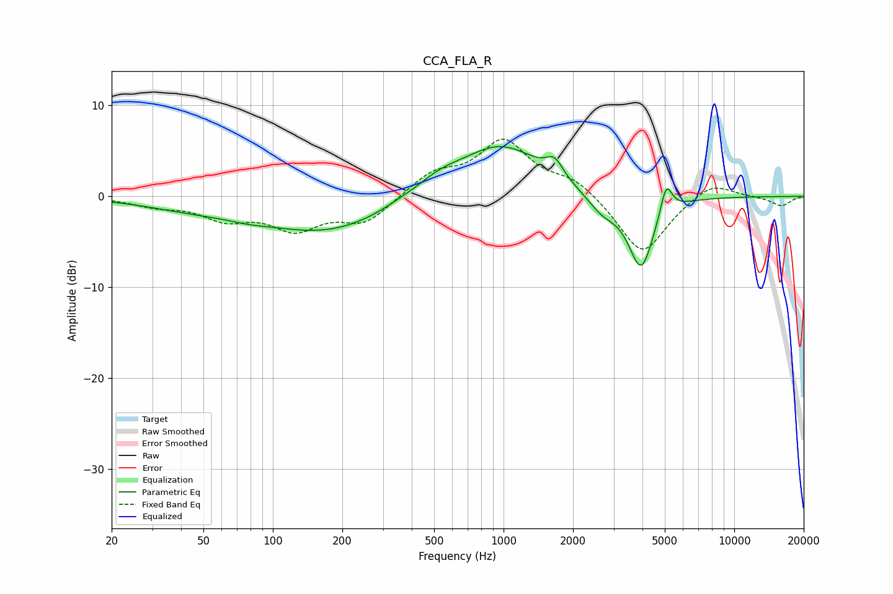

# CCA_FLA_R
See [usage instructions](https://github.com/jaakkopasanen/AutoEq#usage) for more options and info.

### Parametric EQs
Apply preamp of -5.6 dB when using parametric equalizer.

|   # | Type    |   Fc (Hz) |    Q |   Gain (dB) |
|-----|---------|-----------|------|-------------|
|   1 | Peaking |        44 | 0.67 |        -1   |
|   2 | Peaking |        78 | 1.5  |        -0.4 |
|   3 | Peaking |       172 | 0.51 |        -3.9 |
|   4 | Peaking |       345 | 1.88 |         0.2 |
|   5 | Peaking |       522 | 1.29 |         1.5 |
|   6 | Peaking |       972 | 0.79 |         5.6 |
|   7 | Peaking |      1664 | 3.82 |         1.9 |
|   8 | Peaking |      2678 | 2.12 |        -1.9 |
|   9 | Peaking |      3947 | 2.51 |        -8   |
|  10 | Peaking |      5073 | 5.51 |         3.5 |

### Fixed Band EQs
When using fixed band (also called graphic) equalizer, apply preamp of **-6.4 dB** (if available) and set gains manually with these parameters.

|   # | Type    |   Fc (Hz) |    Q |   Gain (dB) |
|-----|---------|-----------|------|-------------|
|   1 | Peaking |        31 | 1.41 |        -0.9 |
|   2 | Peaking |        62 | 1.41 |        -2.2 |
|   3 | Peaking |       125 | 1.41 |        -3.3 |
|   4 | Peaking |       250 | 1.41 |        -2.8 |
|   5 | Peaking |       500 | 1.41 |         2.4 |
|   6 | Peaking |      1000 | 1.41 |         5.9 |
|   7 | Peaking |      2000 | 1.41 |         1.8 |
|   8 | Peaking |      4000 | 1.41 |        -6.6 |
|   9 | Peaking |      8000 | 1.41 |         1.8 |
|  10 | Peaking |     16000 | 1.41 |        -1.1 |

### Graphs

