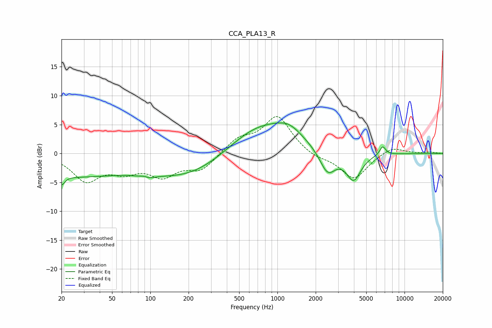

# CCA_PLA13_R
See [usage instructions](https://github.com/jaakkopasanen/AutoEq#usage) for more options and info.

### Parametric EQs
Apply preamp of -5.4 dB when using parametric equalizer.

|   # | Type    |   Fc (Hz) |    Q |   Gain (dB) |
|-----|---------|-----------|------|-------------|
|   1 | Peaking |        20 | 5.97 |        -1.5 |
|   2 | Peaking |        23 | 0.32 |        -3.8 |
|   3 | Peaking |        91 | 3.64 |         3.1 |
|   4 | Peaking |        92 | 3.27 |        -3.4 |
|   5 | Peaking |       208 | 0.45 |        -4.1 |
|   6 | Peaking |       715 | 0.55 |         5.5 |
|   7 | Peaking |      1235 | 1.35 |         2.1 |
|   8 | Peaking |      2482 | 2.24 |        -4.1 |
|   9 | Peaking |      3975 | 2.42 |        -4.6 |
|  10 | Peaking |      6733 | 5.76 |         1.5 |

### Fixed Band EQs
When using fixed band (also called graphic) equalizer, apply preamp of **-6.5 dB** (if available) and set gains manually with these parameters.

|   # | Type    |   Fc (Hz) |    Q |   Gain (dB) |
|-----|---------|-----------|------|-------------|
|   1 | Peaking |        31 | 1.41 |        -4.5 |
|   2 | Peaking |        62 | 1.41 |        -2.5 |
|   3 | Peaking |       125 | 1.41 |        -3.4 |
|   4 | Peaking |       250 | 1.41 |        -2.7 |
|   5 | Peaking |       500 | 1.41 |         2.4 |
|   6 | Peaking |      1000 | 1.41 |         6.4 |
|   7 | Peaking |      2000 | 1.41 |        -0.9 |
|   8 | Peaking |      4000 | 1.41 |        -4.4 |
|   9 | Peaking |      8000 | 1.41 |         1.3 |
|  10 | Peaking |     16000 | 1.41 |         0.2 |

### Graphs

