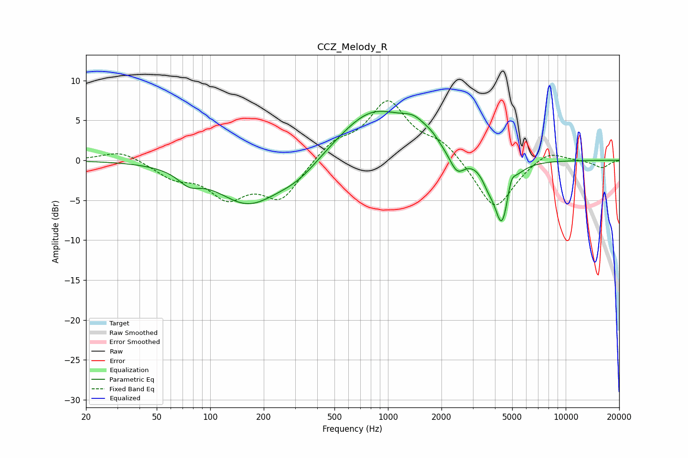

# CCZ_Melody_R
See [usage instructions](https://github.com/jaakkopasanen/AutoEq#usage) for more options and info.

### Parametric EQs
Apply preamp of -6.2 dB when using parametric equalizer.

|   # | Type    |   Fc (Hz) |    Q |   Gain (dB) |
|-----|---------|-----------|------|-------------|
|   1 | Peaking |        76 | 2.34 |        -1.5 |
|   2 | Peaking |       163 | 0.8  |        -5.3 |
|   3 | Peaking |       313 | 1.1  |        -1.9 |
|   4 | Peaking |       826 | 0.7  |         6.3 |
|   5 | Peaking |      1418 | 1.92 |         2   |
|   6 | Peaking |      1767 | 3.58 |         0.6 |
|   7 | Peaking |      2446 | 3.25 |        -2.5 |
|   8 | Peaking |      3653 | 4.33 |        -1.3 |
|   9 | Peaking |      4381 | 3.16 |        -8.2 |
|  10 | Peaking |      4924 | 6    |         2.1 |

### Fixed Band EQs
When using fixed band (also called graphic) equalizer, apply preamp of **-7.5 dB** (if available) and set gains manually with these parameters.

|   # | Type    |   Fc (Hz) |    Q |   Gain (dB) |
|-----|---------|-----------|------|-------------|
|   1 | Peaking |        31 | 1.41 |         1.3 |
|   2 | Peaking |        62 | 1.41 |        -1.9 |
|   3 | Peaking |       125 | 1.41 |        -4.1 |
|   4 | Peaking |       250 | 1.41 |        -4.7 |
|   5 | Peaking |       500 | 1.41 |         2.1 |
|   6 | Peaking |      1000 | 1.41 |         7.1 |
|   7 | Peaking |      2000 | 1.41 |         2.1 |
|   8 | Peaking |      4000 | 1.41 |        -6.4 |
|   9 | Peaking |      8000 | 1.41 |         1.4 |
|  10 | Peaking |     16000 | 1.41 |        -0.9 |

### Graphs

