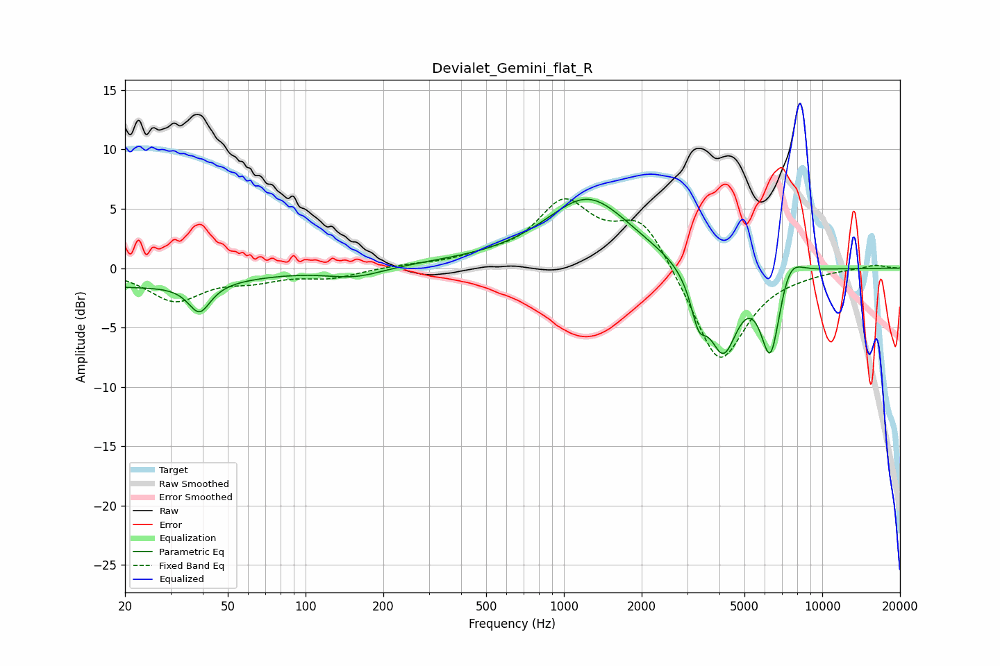

# Devialet_Gemini_flat_R
See [usage instructions](https://github.com/jaakkopasanen/AutoEq#usage) for more options and info.

### Parametric EQs
Apply preamp of -5.9 dB when using parametric equalizer.

|   # | Type    |   Fc (Hz) |    Q |   Gain (dB) |
|-----|---------|-----------|------|-------------|
|   1 | Peaking |        20 | 0.31 |        -1.5 |
|   2 | Peaking |        39 | 3.38 |        -2.4 |
|   3 | Peaking |       156 | 1.2  |        -1   |
|   4 | Peaking |       451 | 0.18 |         0.5 |
|   5 | Peaking |      1242 | 0.87 |         5.6 |
|   6 | Peaking |      3320 | 4.69 |        -3.2 |
|   7 | Peaking |      4144 | 2.24 |        -7.9 |
|   8 | Peaking |      4746 | 1.14 |         1.2 |
|   9 | Peaking |      6312 | 3.38 |        -7.8 |
|  10 | Peaking |      7418 | 2.72 |         2.4 |

### Fixed Band EQs
When using fixed band (also called graphic) equalizer, apply preamp of **-5.9 dB** (if available) and set gains manually with these parameters.

|   # | Type    |   Fc (Hz) |    Q |   Gain (dB) |
|-----|---------|-----------|------|-------------|
|   1 | Peaking |        31 | 1.41 |        -2.7 |
|   2 | Peaking |        62 | 1.41 |        -0.8 |
|   3 | Peaking |       125 | 1.41 |        -0.8 |
|   4 | Peaking |       250 | 1.41 |         0.2 |
|   5 | Peaking |       500 | 1.41 |         0.6 |
|   6 | Peaking |      1000 | 1.41 |         5.3 |
|   7 | Peaking |      2000 | 1.41 |         4.3 |
|   8 | Peaking |      4000 | 1.41 |        -8.4 |
|   9 | Peaking |      8000 | 1.41 |        -0.2 |
|  10 | Peaking |     16000 | 1.41 |         0.3 |

### Graphs

