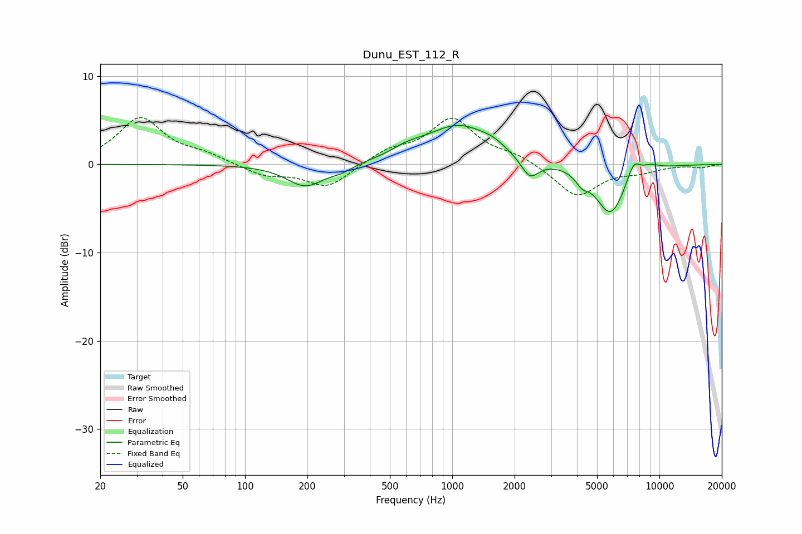

# Dunu_EST_112_R
See [usage instructions](https://github.com/jaakkopasanen/AutoEq#usage) for more options and info.

### Parametric EQs
Apply preamp of -4.5 dB when using parametric equalizer.

|   # | Type    |   Fc (Hz) |    Q |   Gain (dB) |
|-----|---------|-----------|------|-------------|
|   1 | Peaking |       196 | 1.55 |        -2.5 |
|   2 | Peaking |       293 | 2.52 |        -0.6 |
|   3 | Peaking |       605 | 1.88 |         0.7 |
|   4 | Peaking |      1077 | 0.87 |         4.4 |
|   5 | Peaking |      1571 | 2.65 |         0.5 |
|   6 | Peaking |      2370 | 3.22 |        -2.3 |
|   7 | Peaking |      4225 | 4.71 |        -1.1 |
|   8 | Peaking |      5812 | 1.88 |        -5.8 |
|   9 | Peaking |      7500 | 4.03 |         2.1 |
|  10 | Peaking |      9024 | 2.8  |         0.6 |

### Fixed Band EQs
When using fixed band (also called graphic) equalizer, apply preamp of **-5.4 dB** (if available) and set gains manually with these parameters.

|   # | Type    |   Fc (Hz) |    Q |   Gain (dB) |
|-----|---------|-----------|------|-------------|
|   1 | Peaking |        31 | 1.41 |         5.2 |
|   2 | Peaking |        62 | 1.41 |         0.9 |
|   3 | Peaking |       125 | 1.41 |        -1.2 |
|   4 | Peaking |       250 | 1.41 |        -2.6 |
|   5 | Peaking |       500 | 1.41 |         1.4 |
|   6 | Peaking |      1000 | 1.41 |         5   |
|   7 | Peaking |      2000 | 1.41 |         0.9 |
|   8 | Peaking |      4000 | 1.41 |        -3.7 |
|   9 | Peaking |      8000 | 1.41 |        -0.7 |
|  10 | Peaking |     16000 | 1.41 |        -0.3 |

### Graphs

