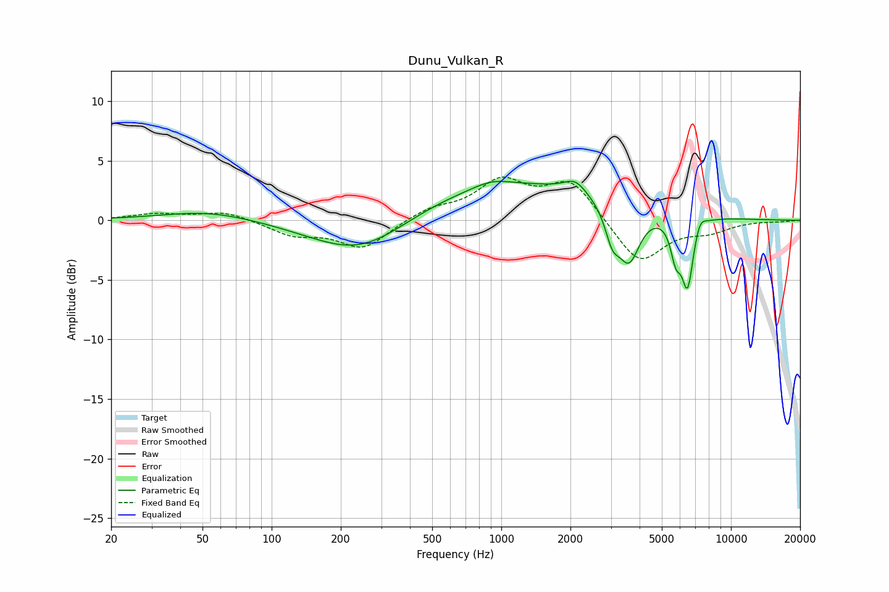

# Dunu_Vulkan_R
See [usage instructions](https://github.com/jaakkopasanen/AutoEq#usage) for more options and info.

### Parametric EQs
Apply preamp of -3.4 dB when using parametric equalizer.

|   # | Type    |   Fc (Hz) |    Q |   Gain (dB) |
|-----|---------|-----------|------|-------------|
|   1 | Peaking |        53 | 0.7  |         0.8 |
|   2 | Peaking |       248 | 0.65 |        -3.7 |
|   3 | Peaking |       908 | 1.73 |         0.6 |
|   4 | Peaking |      1031 | 0.26 |         3.3 |
|   5 | Peaking |      2101 | 2.98 |         1.1 |
|   6 | Peaking |      3043 | 4.5  |        -2.4 |
|   7 | Peaking |      3593 | 2.87 |        -4.7 |
|   8 | Peaking |      5752 | 6    |        -2.8 |
|   9 | Peaking |      6472 | 5.34 |        -5.7 |
|  10 | Peaking |      7323 | 5.63 |         1   |

### Fixed Band EQs
When using fixed band (also called graphic) equalizer, apply preamp of **-3.7 dB** (if available) and set gains manually with these parameters.

|   # | Type    |   Fc (Hz) |    Q |   Gain (dB) |
|-----|---------|-----------|------|-------------|
|   1 | Peaking |        31 | 1.41 |         0.5 |
|   2 | Peaking |        62 | 1.41 |         0.8 |
|   3 | Peaking |       125 | 1.41 |        -1.2 |
|   4 | Peaking |       250 | 1.41 |        -2.3 |
|   5 | Peaking |       500 | 1.41 |         0.9 |
|   6 | Peaking |      1000 | 1.41 |         3.1 |
|   7 | Peaking |      2000 | 1.41 |         3.3 |
|   8 | Peaking |      4000 | 1.41 |        -3.7 |
|   9 | Peaking |      8000 | 1.41 |        -0.8 |
|  10 | Peaking |     16000 | 1.41 |        -0.1 |

### Graphs

