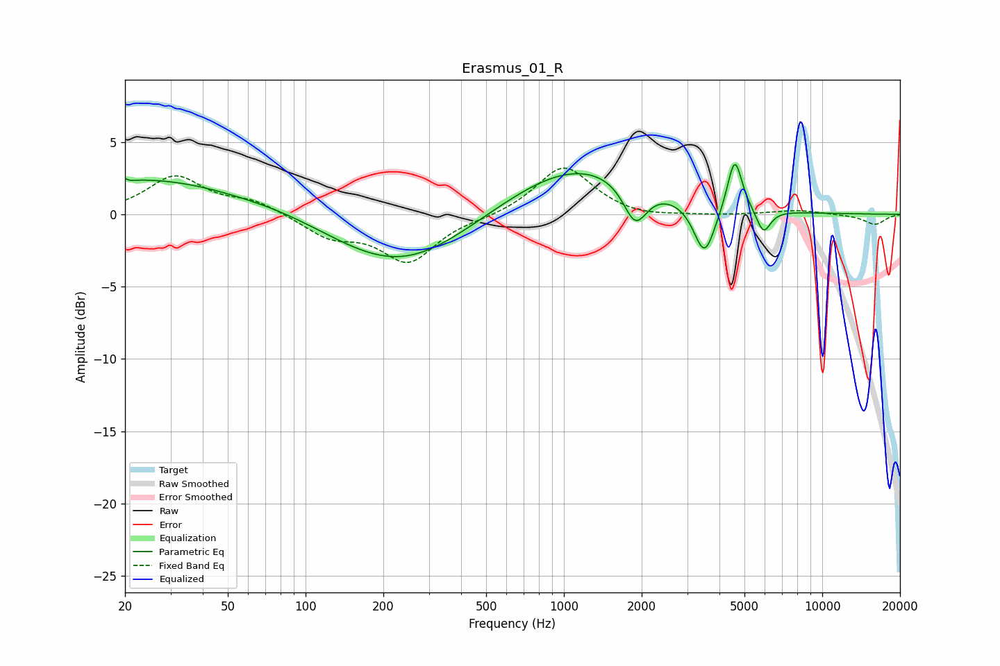

# Erasmus_01_R
See [usage instructions](https://github.com/jaakkopasanen/AutoEq#usage) for more options and info.

### Parametric EQs
Apply preamp of -3.5 dB when using parametric equalizer.

|   # | Type    |   Fc (Hz) |    Q |   Gain (dB) |
|-----|---------|-----------|------|-------------|
|   1 | Peaking |        20 | 5.86 |         2.2 |
|   2 | Peaking |        20 | 6    |        -2.1 |
|   3 | Peaking |        25 | 0.4  |         2.4 |
|   4 | Peaking |        83 | 0.84 |         0.3 |
|   5 | Peaking |       234 | 0.54 |        -3.7 |
|   6 | Peaking |      1136 | 0.51 |         3.6 |
|   7 | Peaking |      1889 | 3.05 |        -2.8 |
|   8 | Peaking |      3502 | 3.4  |        -3.7 |
|   9 | Peaking |      4585 | 4.97 |         3.8 |
|  10 | Peaking |      5922 | 5.02 |        -1.7 |

### Fixed Band EQs
When using fixed band (also called graphic) equalizer, apply preamp of **-3.3 dB** (if available) and set gains manually with these parameters.

|   # | Type    |   Fc (Hz) |    Q |   Gain (dB) |
|-----|---------|-----------|------|-------------|
|   1 | Peaking |        31 | 1.41 |         2.6 |
|   2 | Peaking |        62 | 1.41 |         0.9 |
|   3 | Peaking |       125 | 1.41 |        -1.4 |
|   4 | Peaking |       250 | 1.41 |        -3.2 |
|   5 | Peaking |       500 | 1.41 |        -0.2 |
|   6 | Peaking |      1000 | 1.41 |         3.4 |
|   7 | Peaking |      2000 | 1.41 |        -0.3 |
|   8 | Peaking |      4000 | 1.41 |        -0.1 |
|   9 | Peaking |      8000 | 1.41 |         0.3 |
|  10 | Peaking |     16000 | 1.41 |        -0.7 |

### Graphs

