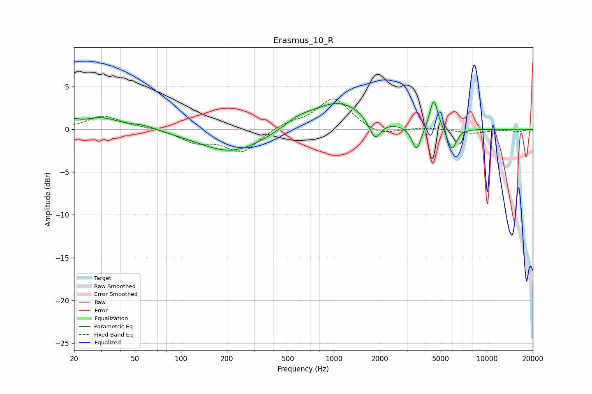

# Erasmus_10_R
See [usage instructions](https://github.com/jaakkopasanen/AutoEq#usage) for more options and info.

### Parametric EQs
Apply preamp of -3.3 dB when using parametric equalizer.

|   # | Type    |   Fc (Hz) |    Q |   Gain (dB) |
|-----|---------|-----------|------|-------------|
|   1 | Peaking |        20 | 5.96 |         0.5 |
|   2 | Peaking |        29 | 1.12 |         1.4 |
|   3 | Peaking |        58 | 1.68 |         0.5 |
|   4 | Peaking |       215 | 0.66 |        -2.7 |
|   5 | Peaking |       581 | 1.56 |         0.8 |
|   6 | Peaking |      1073 | 0.79 |         3.2 |
|   7 | Peaking |      1858 | 3.62 |        -2.5 |
|   8 | Peaking |      3480 | 4.62 |        -2.9 |
|   9 | Peaking |      4503 | 5.17 |         3.7 |
|  10 | Peaking |      5920 | 4.55 |        -2.6 |

### Fixed Band EQs
When using fixed band (also called graphic) equalizer, apply preamp of **-3.6 dB** (if available) and set gains manually with these parameters.

|   # | Type    |   Fc (Hz) |    Q |   Gain (dB) |
|-----|---------|-----------|------|-------------|
|   1 | Peaking |        31 | 1.41 |         1.5 |
|   2 | Peaking |        62 | 1.41 |         0.2 |
|   3 | Peaking |       125 | 1.41 |        -1.4 |
|   4 | Peaking |       250 | 1.41 |        -2.6 |
|   5 | Peaking |       500 | 1.41 |         0.7 |
|   6 | Peaking |      1000 | 1.41 |         3.7 |
|   7 | Peaking |      2000 | 1.41 |        -0.9 |
|   8 | Peaking |      4000 | 1.41 |         0.2 |
|   9 | Peaking |      8000 | 1.41 |        -0.5 |
|  10 | Peaking |     16000 | 1.41 |        -0.3 |

### Graphs

