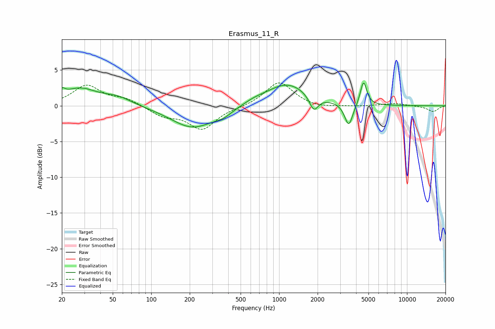

# Erasmus_11_R
See [usage instructions](https://github.com/jaakkopasanen/AutoEq#usage) for more options and info.

### Parametric EQs
Apply preamp of -3.3 dB when using parametric equalizer.

|   # | Type    |   Fc (Hz) |    Q |   Gain (dB) |
|-----|---------|-----------|------|-------------|
|   1 | Peaking |        20 | 5.99 |         0.9 |
|   2 | Peaking |        27 | 1.05 |         2.3 |
|   3 | Peaking |        55 | 1.27 |         1   |
|   4 | Peaking |       211 | 0.83 |        -3.1 |
|   5 | Peaking |       367 | 2.09 |        -0.7 |
|   6 | Peaking |       640 | 1.7  |         0.4 |
|   7 | Peaking |      1154 | 0.87 |         3.1 |
|   8 | Peaking |      1868 | 4.11 |        -2.1 |
|   9 | Peaking |      3503 | 4.49 |        -3.2 |
|  10 | Peaking |      4571 | 5.63 |         3.4 |

### Fixed Band EQs
When using fixed band (also called graphic) equalizer, apply preamp of **-3.3 dB** (if available) and set gains manually with these parameters.

|   # | Type    |   Fc (Hz) |    Q |   Gain (dB) |
|-----|---------|-----------|------|-------------|
|   1 | Peaking |        31 | 1.41 |         2.8 |
|   2 | Peaking |        62 | 1.41 |         0.9 |
|   3 | Peaking |       125 | 1.41 |        -1.3 |
|   4 | Peaking |       250 | 1.41 |        -3.2 |
|   5 | Peaking |       500 | 1.41 |        -0.2 |
|   6 | Peaking |      1000 | 1.41 |         3.4 |
|   7 | Peaking |      2000 | 1.41 |        -0.4 |
|   8 | Peaking |      4000 | 1.41 |        -0.1 |
|   9 | Peaking |      8000 | 1.41 |         0.3 |
|  10 | Peaking |     16000 | 1.41 |        -0.8 |

### Graphs

