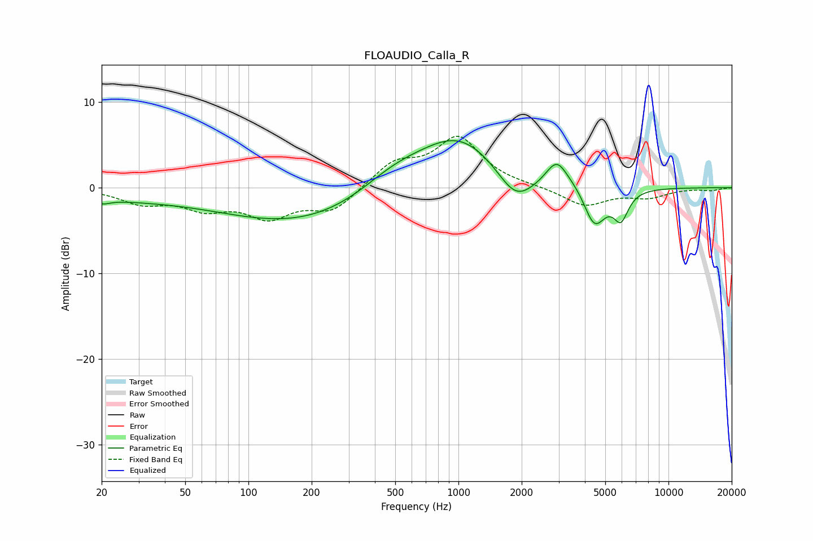

# FLOAUDIO_Calla_R
See [usage instructions](https://github.com/jaakkopasanen/AutoEq#usage) for more options and info.

### Parametric EQs
Apply preamp of -5.6 dB when using parametric equalizer.

|   # | Type    |   Fc (Hz) |    Q |   Gain (dB) |
|-----|---------|-----------|------|-------------|
|   1 | Peaking |        20 | 4.03 |        -0.5 |
|   2 | Peaking |        24 | 0.47 |        -1   |
|   3 | Peaking |       178 | 0.37 |        -4.2 |
|   4 | Peaking |       491 | 0.84 |         2.4 |
|   5 | Peaking |      1010 | 0.71 |         6   |
|   6 | Peaking |      1873 | 1.59 |        -3.8 |
|   7 | Peaking |      2939 | 2.78 |         3   |
|   8 | Peaking |      3728 | 2.14 |         0.7 |
|   9 | Peaking |      4436 | 2.6  |        -4.8 |
|  10 | Peaking |      5936 | 3.9  |        -3.2 |

### Fixed Band EQs
When using fixed band (also called graphic) equalizer, apply preamp of **-6.1 dB** (if available) and set gains manually with these parameters.

|   # | Type    |   Fc (Hz) |    Q |   Gain (dB) |
|-----|---------|-----------|------|-------------|
|   1 | Peaking |        31 | 1.41 |        -1.6 |
|   2 | Peaking |        62 | 1.41 |        -2.1 |
|   3 | Peaking |       125 | 1.41 |        -3.1 |
|   4 | Peaking |       250 | 1.41 |        -2.6 |
|   5 | Peaking |       500 | 1.41 |         2.8 |
|   6 | Peaking |      1000 | 1.41 |         5.7 |
|   7 | Peaking |      2000 | 1.41 |         0.1 |
|   8 | Peaking |      4000 | 1.41 |        -2.1 |
|   9 | Peaking |      8000 | 1.41 |        -1   |
|  10 | Peaking |     16000 | 1.41 |        -0.3 |

### Graphs

