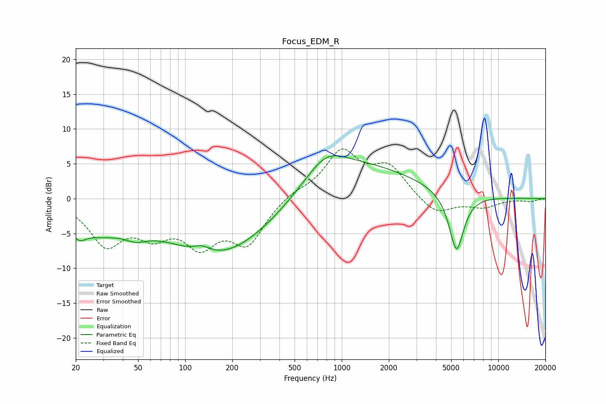

# Focus_EDM_R
See [usage instructions](https://github.com/jaakkopasanen/AutoEq#usage) for more options and info.

### Parametric EQs
Apply preamp of -6.2 dB when using parametric equalizer.

|   # | Type    |   Fc (Hz) |    Q |   Gain (dB) |
|-----|---------|-----------|------|-------------|
|   1 | Peaking |        21 | 2.89 |        -2.5 |
|   2 | Peaking |        28 | 0.94 |        -3.3 |
|   3 | Peaking |        48 | 1.84 |        -1.4 |
|   4 | Peaking |       129 | 2.53 |         1   |
|   5 | Peaking |       166 | 0.4  |        -8.6 |
|   6 | Peaking |       360 | 0.46 |        -3.1 |
|   7 | Peaking |       672 | 2.54 |         0   |
|   8 | Peaking |       773 | 0.26 |         6.4 |
|   9 | Peaking |       790 | 1.12 |         3.4 |
|  10 | Peaking |      5407 | 2.92 |        -8.6 |

### Fixed Band EQs
When using fixed band (also called graphic) equalizer, apply preamp of **-7.2 dB** (if available) and set gains manually with these parameters.

|   # | Type    |   Fc (Hz) |    Q |   Gain (dB) |
|-----|---------|-----------|------|-------------|
|   1 | Peaking |        31 | 1.41 |        -6.2 |
|   2 | Peaking |        62 | 1.41 |        -4.1 |
|   3 | Peaking |       125 | 1.41 |        -5.7 |
|   4 | Peaking |       250 | 1.41 |        -6   |
|   5 | Peaking |       500 | 1.41 |         0.9 |
|   6 | Peaking |      1000 | 1.41 |         6.5 |
|   7 | Peaking |      2000 | 1.41 |         4.3 |
|   8 | Peaking |      4000 | 1.41 |        -2.4 |
|   9 | Peaking |      8000 | 1.41 |        -1.2 |
|  10 | Peaking |     16000 | 1.41 |        -0.4 |

### Graphs

