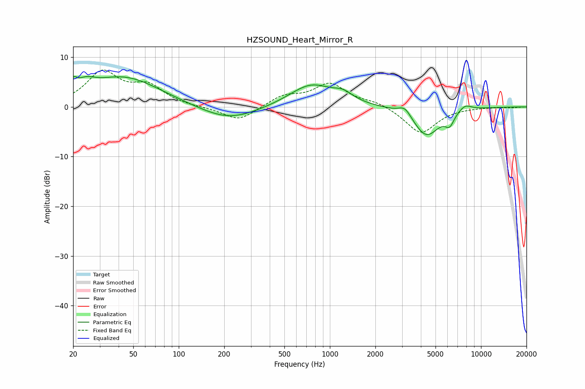

# HZSOUND_Heart_Mirror_R
See [usage instructions](https://github.com/jaakkopasanen/AutoEq#usage) for more options and info.

### Parametric EQs
Apply preamp of -6.2 dB when using parametric equalizer.

|   # | Type    |   Fc (Hz) |    Q |   Gain (dB) |
|-----|---------|-----------|------|-------------|
|   1 | Peaking |        20 | 5.91 |         2   |
|   2 | Peaking |        24 | 2.5  |         1.8 |
|   3 | Peaking |        43 | 0.58 |         6   |
|   4 | Peaking |       213 | 0.74 |        -2.9 |
|   5 | Peaking |       753 | 0.97 |         4.6 |
|   6 | Peaking |      1226 | 2.29 |         1.5 |
|   7 | Peaking |      3135 | 3.4  |         1.9 |
|   8 | Peaking |      4346 | 1.59 |        -5.9 |
|   9 | Peaking |      6203 | 4.7  |        -2.2 |
|  10 | Peaking |      7852 | 3.1  |         1.3 |

### Fixed Band EQs
When using fixed band (also called graphic) equalizer, apply preamp of **-7.5 dB** (if available) and set gains manually with these parameters.

|   # | Type    |   Fc (Hz) |    Q |   Gain (dB) |
|-----|---------|-----------|------|-------------|
|   1 | Peaking |        31 | 1.41 |         6.7 |
|   2 | Peaking |        62 | 1.41 |         3.8 |
|   3 | Peaking |       125 | 1.41 |        -0.1 |
|   4 | Peaking |       250 | 1.41 |        -2.9 |
|   5 | Peaking |       500 | 1.41 |         2.1 |
|   6 | Peaking |      1000 | 1.41 |         4.5 |
|   7 | Peaking |      2000 | 1.41 |         1   |
|   8 | Peaking |      4000 | 1.41 |        -5.4 |
|   9 | Peaking |      8000 | 1.41 |        -0   |
|  10 | Peaking |     16000 | 1.41 |        -0.1 |

### Graphs

