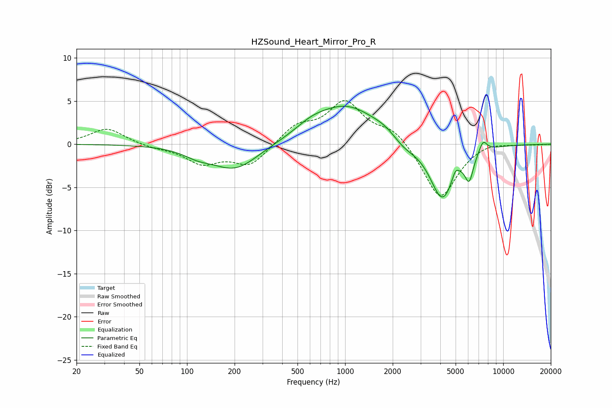

# HZSound_Heart_Mirror_Pro_R
See [usage instructions](https://github.com/jaakkopasanen/AutoEq#usage) for more options and info.

### Parametric EQs
Apply preamp of -4.5 dB when using parametric equalizer.

|   # | Type    |   Fc (Hz) |    Q |   Gain (dB) |
|-----|---------|-----------|------|-------------|
|   1 | Peaking |       116 | 1.58 |        -0.8 |
|   2 | Peaking |       202 | 0.97 |        -3   |
|   3 | Peaking |       611 | 1.41 |         0.9 |
|   4 | Peaking |      1021 | 0.71 |         4.4 |
|   5 | Peaking |      1813 | 1.81 |         0.6 |
|   6 | Peaking |      2342 | 1.77 |        -1.1 |
|   7 | Peaking |      4126 | 1.79 |        -6.6 |
|   8 | Peaking |      4987 | 6    |         1.2 |
|   9 | Peaking |      6095 | 5.25 |        -2.9 |
|  10 | Peaking |      7462 | 5.35 |         1.4 |

### Fixed Band EQs
When using fixed band (also called graphic) equalizer, apply preamp of **-5.2 dB** (if available) and set gains manually with these parameters.

|   # | Type    |   Fc (Hz) |    Q |   Gain (dB) |
|-----|---------|-----------|------|-------------|
|   1 | Peaking |        31 | 1.41 |         1.9 |
|   2 | Peaking |        62 | 1.41 |        -0.4 |
|   3 | Peaking |       125 | 1.41 |        -2.1 |
|   4 | Peaking |       250 | 1.41 |        -2.5 |
|   5 | Peaking |       500 | 1.41 |         2   |
|   6 | Peaking |      1000 | 1.41 |         4.7 |
|   7 | Peaking |      2000 | 1.41 |         1.8 |
|   8 | Peaking |      4000 | 1.41 |        -6.4 |
|   9 | Peaking |      8000 | 1.41 |         0.4 |
|  10 | Peaking |     16000 | 1.41 |        -0   |

### Graphs

