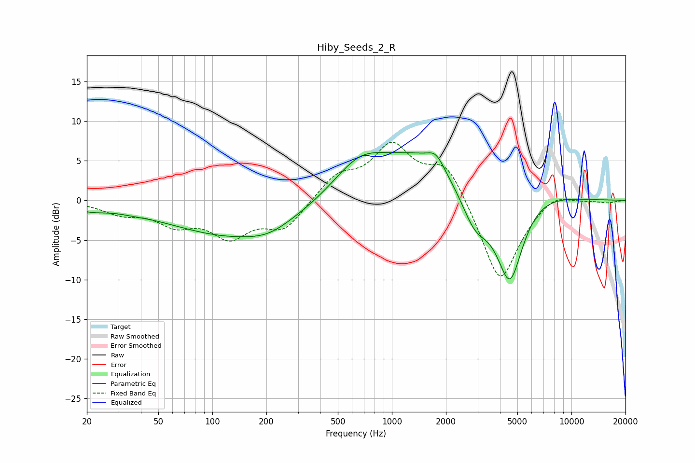

# Hiby_Seeds_2_R
See [usage instructions](https://github.com/jaakkopasanen/AutoEq#usage) for more options and info.

### Parametric EQs
Apply preamp of -6.1 dB when using parametric equalizer.

|   # | Type    |   Fc (Hz) |    Q |   Gain (dB) |
|-----|---------|-----------|------|-------------|
|   1 | Peaking |        21 | 1.5  |        -0.8 |
|   2 | Peaking |        36 | 1.65 |        -0.2 |
|   3 | Peaking |       134 | 0.39 |        -4.5 |
|   4 | Peaking |       205 | 1.25 |        -0.9 |
|   5 | Peaking |       663 | 0.91 |         4.6 |
|   6 | Peaking |      1467 | 0.67 |         5.1 |
|   7 | Peaking |      1759 | 3.09 |         1.7 |
|   8 | Peaking |      2892 | 1.88 |        -4   |
|   9 | Peaking |      4542 | 1.67 |       -12.5 |
|  10 | Peaking |      5685 | 0.76 |         2.6 |

### Fixed Band EQs
When using fixed band (also called graphic) equalizer, apply preamp of **-7.4 dB** (if available) and set gains manually with these parameters.

|   # | Type    |   Fc (Hz) |    Q |   Gain (dB) |
|-----|---------|-----------|------|-------------|
|   1 | Peaking |        31 | 1.41 |        -1.4 |
|   2 | Peaking |        62 | 1.41 |        -2.6 |
|   3 | Peaking |       125 | 1.41 |        -4.1 |
|   4 | Peaking |       250 | 1.41 |        -3.5 |
|   5 | Peaking |       500 | 1.41 |         2.9 |
|   6 | Peaking |      1000 | 1.41 |         6.5 |
|   7 | Peaking |      2000 | 1.41 |         4.8 |
|   8 | Peaking |      4000 | 1.41 |       -10.8 |
|   9 | Peaking |      8000 | 1.41 |         1.5 |
|  10 | Peaking |     16000 | 1.41 |        -0.3 |

### Graphs

