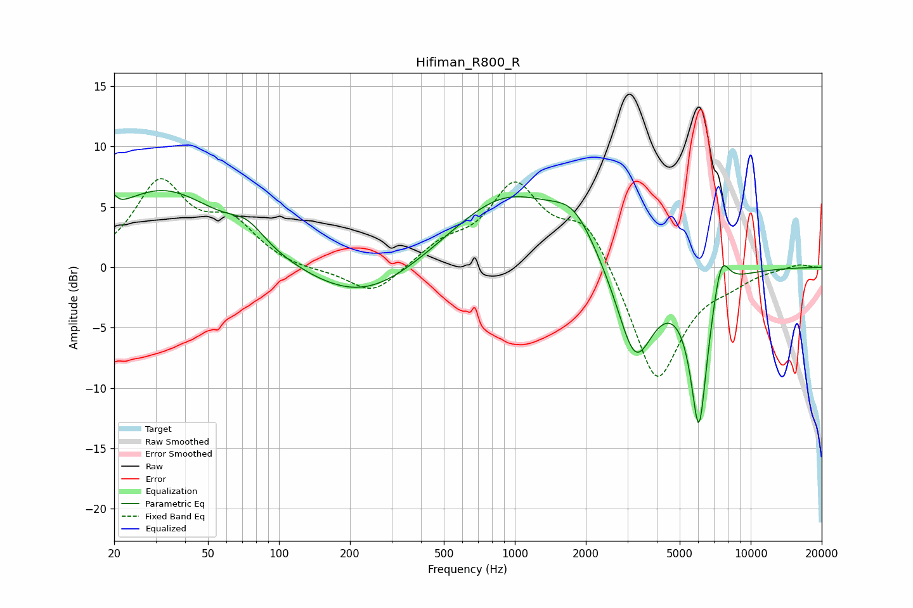

# Hifiman_R800_R
See [usage instructions](https://github.com/jaakkopasanen/AutoEq#usage) for more options and info.

### Parametric EQs
Apply preamp of -6.4 dB when using parametric equalizer.

|   # | Type    |   Fc (Hz) |    Q |   Gain (dB) |
|-----|---------|-----------|------|-------------|
|   1 | Peaking |        20 | 6    |         3.8 |
|   2 | Peaking |        20 | 6    |        -2.6 |
|   3 | Peaking |        32 | 0.56 |         6.4 |
|   4 | Peaking |        73 | 1.92 |         1.6 |
|   5 | Peaking |       228 | 0.6  |        -3.2 |
|   6 | Peaking |       926 | 0.58 |         6.1 |
|   7 | Peaking |      1782 | 1.53 |         2.7 |
|   8 | Peaking |      3239 | 1.72 |        -8.3 |
|   9 | Peaking |      6033 | 3.62 |       -12.8 |
|  10 | Peaking |      7485 | 3.97 |         3.5 |

### Fixed Band EQs
When using fixed band (also called graphic) equalizer, apply preamp of **-7.4 dB** (if available) and set gains manually with these parameters.

|   # | Type    |   Fc (Hz) |    Q |   Gain (dB) |
|-----|---------|-----------|------|-------------|
|   1 | Peaking |        31 | 1.41 |         6.8 |
|   2 | Peaking |        62 | 1.41 |         3.2 |
|   3 | Peaking |       125 | 1.41 |        -0.3 |
|   4 | Peaking |       250 | 1.41 |        -2.4 |
|   5 | Peaking |       500 | 1.41 |         1.6 |
|   6 | Peaking |      1000 | 1.41 |         6.5 |
|   7 | Peaking |      2000 | 1.41 |         4   |
|   8 | Peaking |      4000 | 1.41 |        -9.8 |
|   9 | Peaking |      8000 | 1.41 |        -0.8 |
|  10 | Peaking |     16000 | 1.41 |         0.3 |

### Graphs

