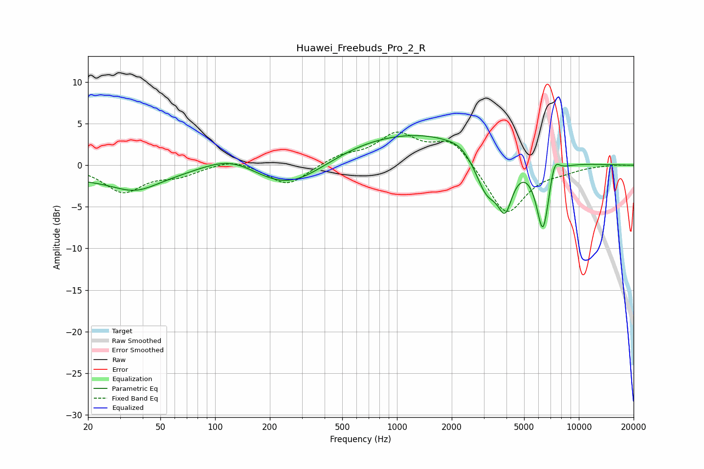

# Huawei_Freebuds_Pro_2_R
See [usage instructions](https://github.com/jaakkopasanen/AutoEq#usage) for more options and info.

### Parametric EQs
Apply preamp of -3.7 dB when using parametric equalizer.

|   # | Type    |   Fc (Hz) |    Q |   Gain (dB) |
|-----|---------|-----------|------|-------------|
|   1 | Peaking |        20 | 0.19 |        -1.5 |
|   2 | Peaking |        37 | 1.14 |        -1.7 |
|   3 | Peaking |       123 | 0.85 |         2.3 |
|   4 | Peaking |       253 | 0.67 |        -3.9 |
|   5 | Peaking |      1259 | 0.27 |         4.2 |
|   6 | Peaking |      2216 | 2.66 |         0.4 |
|   7 | Peaking |      3114 | 2.1  |        -5.1 |
|   8 | Peaking |      3933 | 3.36 |        -5.4 |
|   9 | Peaking |      6345 | 3.68 |        -8.7 |
|  10 | Peaking |      7336 | 4.96 |         2.5 |

### Fixed Band EQs
When using fixed band (also called graphic) equalizer, apply preamp of **-4.1 dB** (if available) and set gains manually with these parameters.

|   # | Type    |   Fc (Hz) |    Q |   Gain (dB) |
|-----|---------|-----------|------|-------------|
|   1 | Peaking |        31 | 1.41 |        -3.1 |
|   2 | Peaking |        62 | 1.41 |        -1.1 |
|   3 | Peaking |       125 | 1.41 |         0.9 |
|   4 | Peaking |       250 | 1.41 |        -2.5 |
|   5 | Peaking |       500 | 1.41 |         1.1 |
|   6 | Peaking |      1000 | 1.41 |         3.5 |
|   7 | Peaking |      2000 | 1.41 |         3.1 |
|   8 | Peaking |      4000 | 1.41 |        -6.1 |
|   9 | Peaking |      8000 | 1.41 |        -0.5 |
|  10 | Peaking |     16000 | 1.41 |         0.1 |

### Graphs

