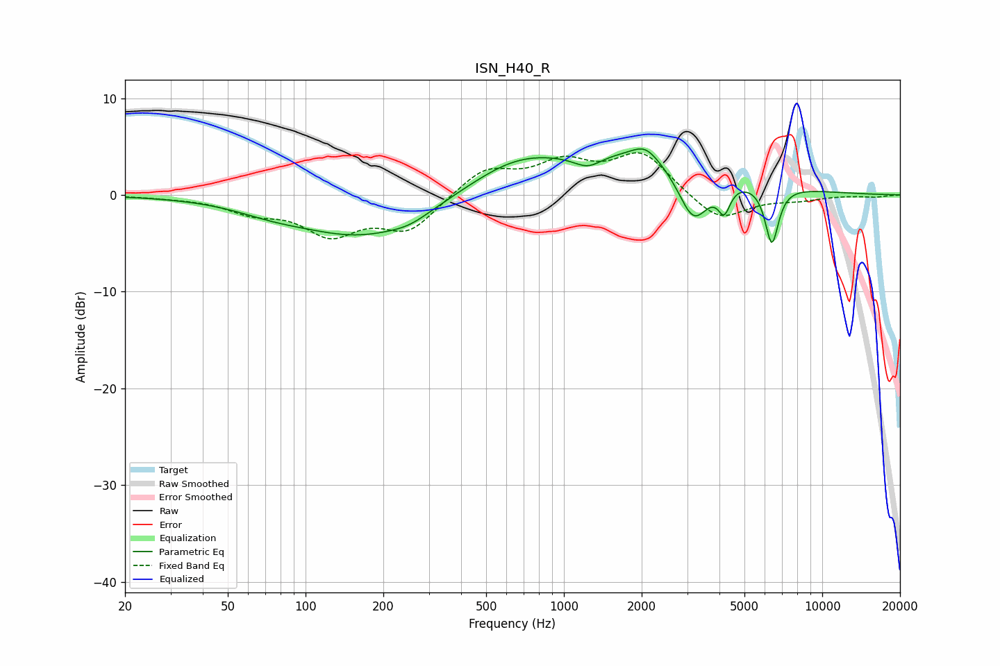

# ISN_H40_R
See [usage instructions](https://github.com/jaakkopasanen/AutoEq#usage) for more options and info.

### Parametric EQs
Apply preamp of -4.9 dB when using parametric equalizer.

|   # | Type    |   Fc (Hz) |    Q |   Gain (dB) |
|-----|---------|-----------|------|-------------|
|   1 | Peaking |        73 | 1.03 |        -0.7 |
|   2 | Peaking |       166 | 0.57 |        -4.2 |
|   3 | Peaking |       253 | 1.88 |        -0.7 |
|   4 | Peaking |       655 | 0.75 |         3.1 |
|   5 | Peaking |      1237 | 2.58 |        -1.3 |
|   6 | Peaking |      2063 | 2.9  |         1.3 |
|   7 | Peaking |      2219 | 0.49 |         4.4 |
|   8 | Peaking |      3173 | 2.22 |        -6   |
|   9 | Peaking |      4173 | 6    |        -2.7 |
|  10 | Peaking |      6382 | 5.23 |        -6.1 |

### Fixed Band EQs
When using fixed band (also called graphic) equalizer, apply preamp of **-4.4 dB** (if available) and set gains manually with these parameters.

|   # | Type    |   Fc (Hz) |    Q |   Gain (dB) |
|-----|---------|-----------|------|-------------|
|   1 | Peaking |        31 | 1.41 |        -0.1 |
|   2 | Peaking |        62 | 1.41 |        -1.5 |
|   3 | Peaking |       125 | 1.41 |        -3.7 |
|   4 | Peaking |       250 | 1.41 |        -3.5 |
|   5 | Peaking |       500 | 1.41 |         2.7 |
|   6 | Peaking |      1000 | 1.41 |         3   |
|   7 | Peaking |      2000 | 1.41 |         4.2 |
|   8 | Peaking |      4000 | 1.41 |        -2.9 |
|   9 | Peaking |      8000 | 1.41 |        -0.5 |
|  10 | Peaking |     16000 | 1.41 |        -0.2 |

### Graphs

