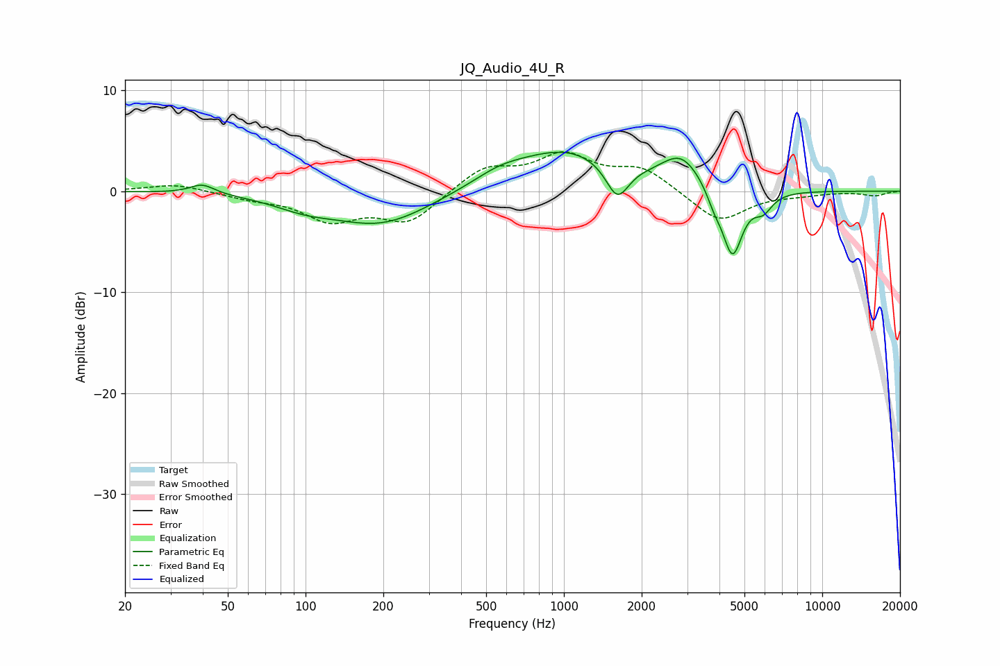

# JQ_Audio_4U_R
See [usage instructions](https://github.com/jaakkopasanen/AutoEq#usage) for more options and info.

### Parametric EQs
Apply preamp of -4.0 dB when using parametric equalizer.

|   # | Type    |   Fc (Hz) |    Q |   Gain (dB) |
|-----|---------|-----------|------|-------------|
|   1 | Peaking |        40 | 3.03 |         1   |
|   2 | Peaking |        99 | 1.17 |        -1   |
|   3 | Peaking |       197 | 0.74 |        -3.3 |
|   4 | Peaking |       563 | 1.33 |         1.1 |
|   5 | Peaking |      1028 | 0.69 |         4   |
|   6 | Peaking |      1610 | 3.18 |        -3.5 |
|   7 | Peaking |      2852 | 1.82 |         3.1 |
|   8 | Peaking |      3819 | 4.81 |        -1.3 |
|   9 | Peaking |      4491 | 3.5  |        -6.7 |
|  10 | Peaking |      5909 | 3.89 |        -1.6 |

### Fixed Band EQs
When using fixed band (also called graphic) equalizer, apply preamp of **-4.0 dB** (if available) and set gains manually with these parameters.

|   # | Type    |   Fc (Hz) |    Q |   Gain (dB) |
|-----|---------|-----------|------|-------------|
|   1 | Peaking |        31 | 1.41 |         0.7 |
|   2 | Peaking |        62 | 1.41 |        -0.6 |
|   3 | Peaking |       125 | 1.41 |        -2.7 |
|   4 | Peaking |       250 | 1.41 |        -3   |
|   5 | Peaking |       500 | 1.41 |         2.3 |
|   6 | Peaking |      1000 | 1.41 |         3.3 |
|   7 | Peaking |      2000 | 1.41 |         2.2 |
|   8 | Peaking |      4000 | 1.41 |        -3.1 |
|   9 | Peaking |      8000 | 1.41 |        -0.3 |
|  10 | Peaking |     16000 | 1.41 |        -0.4 |

### Graphs

