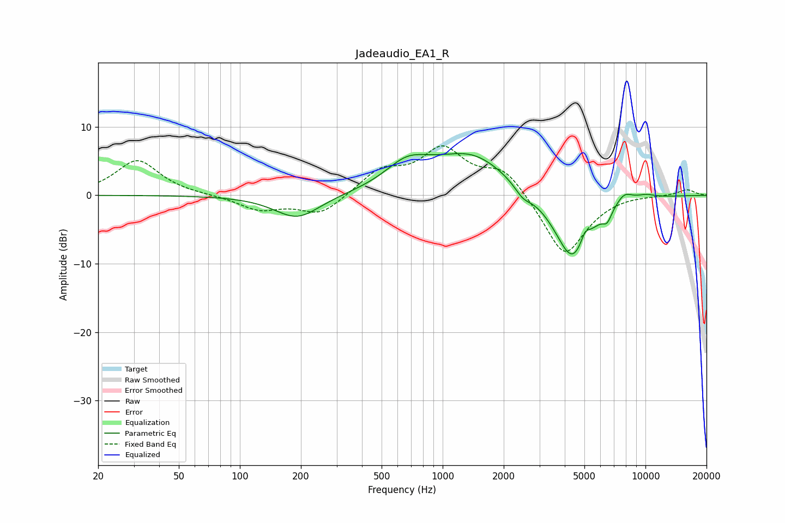

# Jadeaudio_EA1_R
See [usage instructions](https://github.com/jaakkopasanen/AutoEq#usage) for more options and info.

### Parametric EQs
Apply preamp of -6.2 dB when using parametric equalizer.

|   # | Type    |   Fc (Hz) |    Q |   Gain (dB) |
|-----|---------|-----------|------|-------------|
|   1 | Peaking |       192 | 1.26 |        -3.5 |
|   2 | Peaking |       666 | 1.32 |         3.3 |
|   3 | Peaking |      1146 | 1.89 |        -0.2 |
|   4 | Peaking |      1359 | 0.72 |         6.1 |
|   5 | Peaking |      2484 | 3.47 |        -1.4 |
|   6 | Peaking |      4357 | 1.51 |       -10.1 |
|   7 | Peaking |      5038 | 6    |         1.7 |
|   8 | Peaking |      6472 | 5.99 |        -1.6 |
|   9 | Peaking |      7851 | 3.16 |         1.6 |
|  10 | Peaking |     10000 | 2.38 |         0.6 |

### Fixed Band EQs
When using fixed band (also called graphic) equalizer, apply preamp of **-7.3 dB** (if available) and set gains manually with these parameters.

|   # | Type    |   Fc (Hz) |    Q |   Gain (dB) |
|-----|---------|-----------|------|-------------|
|   1 | Peaking |        31 | 1.41 |         5.1 |
|   2 | Peaking |        62 | 1.41 |         0   |
|   3 | Peaking |       125 | 1.41 |        -2.1 |
|   4 | Peaking |       250 | 1.41 |        -2.9 |
|   5 | Peaking |       500 | 1.41 |         3.4 |
|   6 | Peaking |      1000 | 1.41 |         6.3 |
|   7 | Peaking |      2000 | 1.41 |         3.9 |
|   8 | Peaking |      4000 | 1.41 |        -9.1 |
|   9 | Peaking |      8000 | 1.41 |         0.2 |
|  10 | Peaking |     16000 | 1.41 |         0.9 |

### Graphs

