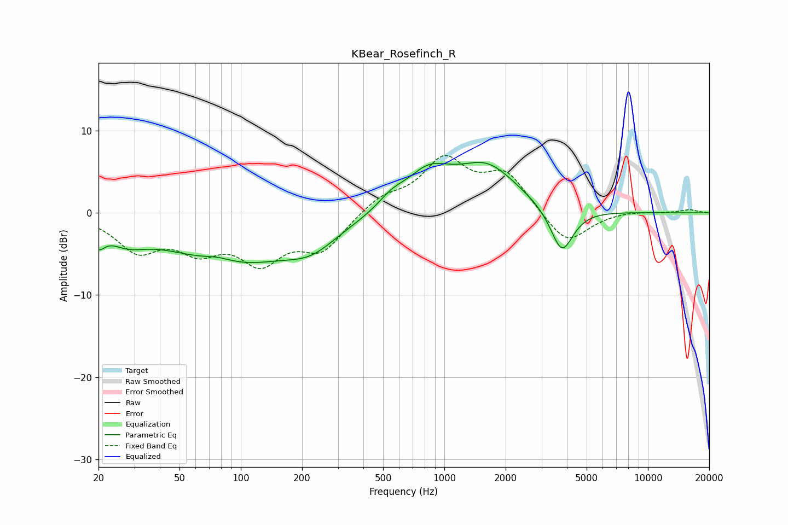

# KBear_Rosefinch_R
See [usage instructions](https://github.com/jaakkopasanen/AutoEq#usage) for more options and info.

### Parametric EQs
Apply preamp of -6.2 dB when using parametric equalizer.

|   # | Type    |   Fc (Hz) |    Q |   Gain (dB) |
|-----|---------|-----------|------|-------------|
|   1 | Peaking |        20 | 4.67 |        -2   |
|   2 | Peaking |        27 | 1.44 |        -2   |
|   3 | Peaking |        77 | 1.82 |         0.8 |
|   4 | Peaking |        91 | 0.44 |        -6   |
|   5 | Peaking |       223 | 1.14 |        -2.3 |
|   6 | Peaking |       551 | 2.04 |         1.4 |
|   7 | Peaking |       830 | 1.32 |         3.8 |
|   8 | Peaking |      1366 | 1.58 |        -0.4 |
|   9 | Peaking |      1572 | 0.9  |         5.9 |
|  10 | Peaking |      3777 | 2.5  |        -5.7 |

### Fixed Band EQs
When using fixed band (also called graphic) equalizer, apply preamp of **-7.1 dB** (if available) and set gains manually with these parameters.

|   # | Type    |   Fc (Hz) |    Q |   Gain (dB) |
|-----|---------|-----------|------|-------------|
|   1 | Peaking |        31 | 1.41 |        -4.2 |
|   2 | Peaking |        62 | 1.41 |        -3.7 |
|   3 | Peaking |       125 | 1.41 |        -5.3 |
|   4 | Peaking |       250 | 1.41 |        -4.2 |
|   5 | Peaking |       500 | 1.41 |         1.8 |
|   6 | Peaking |      1000 | 1.41 |         6.1 |
|   7 | Peaking |      2000 | 1.41 |         4.6 |
|   8 | Peaking |      4000 | 1.41 |        -4   |
|   9 | Peaking |      8000 | 1.41 |         0.3 |
|  10 | Peaking |     16000 | 1.41 |         0.4 |

### Graphs

