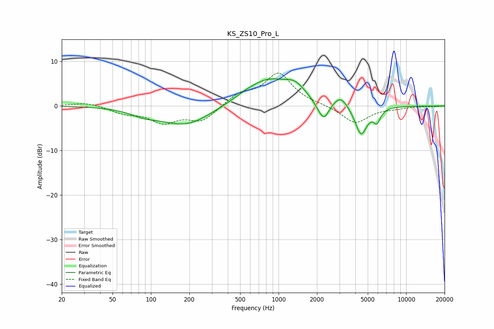

# KS_ZS10_Pro_L
See [usage instructions](https://github.com/jaakkopasanen/AutoEq#usage) for more options and info.

### Parametric EQs
Apply preamp of -6.2 dB when using parametric equalizer.

|   # | Type    |   Fc (Hz) |    Q |   Gain (dB) |
|-----|---------|-----------|------|-------------|
|   1 | Peaking |        88 | 1.36 |        -1.2 |
|   2 | Peaking |       188 | 0.73 |        -4.3 |
|   3 | Peaking |       566 | 1.24 |         0.7 |
|   4 | Peaking |       845 | 0.79 |         5.6 |
|   5 | Peaking |      1358 | 1.82 |         2.5 |
|   6 | Peaking |      2100 | 2.78 |        -1.2 |
|   7 | Peaking |      2275 | 3.51 |        -3.4 |
|   8 | Peaking |      3066 | 2.61 |         2.4 |
|   9 | Peaking |      4428 | 2.9  |        -6.7 |
|  10 | Peaking |      5905 | 4.95 |        -2.7 |

### Fixed Band EQs
When using fixed band (also called graphic) equalizer, apply preamp of **-7.5 dB** (if available) and set gains manually with these parameters.

|   # | Type    |   Fc (Hz) |    Q |   Gain (dB) |
|-----|---------|-----------|------|-------------|
|   1 | Peaking |        31 | 1.41 |         0.8 |
|   2 | Peaking |        62 | 1.41 |        -1.4 |
|   3 | Peaking |       125 | 1.41 |        -3.4 |
|   4 | Peaking |       250 | 1.41 |        -3.3 |
|   5 | Peaking |       500 | 1.41 |         2.4 |
|   6 | Peaking |      1000 | 1.41 |         7.2 |
|   7 | Peaking |      2000 | 1.41 |         0.2 |
|   8 | Peaking |      4000 | 1.41 |        -3.9 |
|   9 | Peaking |      8000 | 1.41 |        -0.4 |
|  10 | Peaking |     16000 | 1.41 |        -0.1 |

### Graphs

