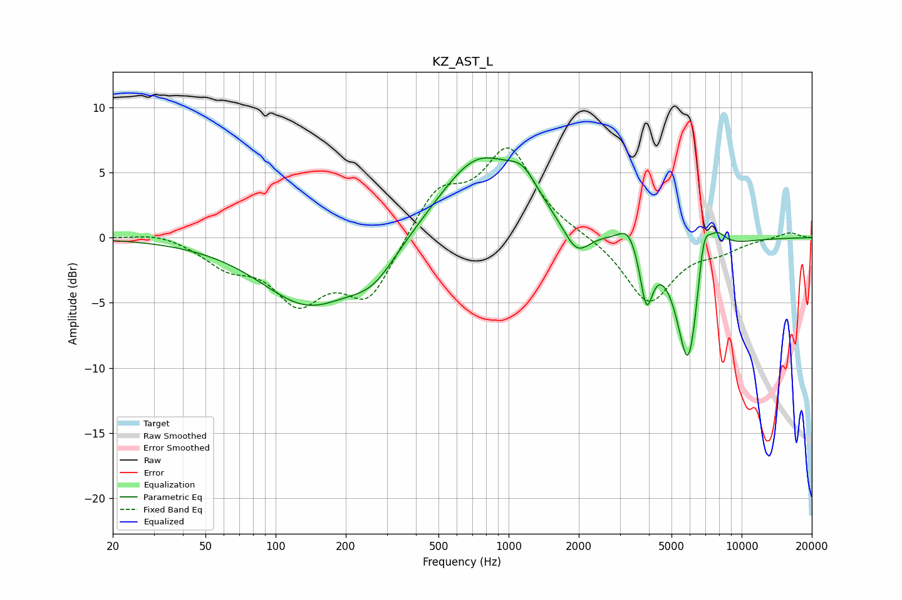

# KZ_AST_L
See [usage instructions](https://github.com/jaakkopasanen/AutoEq#usage) for more options and info.

### Parametric EQs
Apply preamp of -6.2 dB when using parametric equalizer.

|   # | Type    |   Fc (Hz) |    Q |   Gain (dB) |
|-----|---------|-----------|------|-------------|
|   1 | Peaking |       138 | 0.69 |        -5   |
|   2 | Peaking |       262 | 1.34 |        -2.3 |
|   3 | Peaking |       742 | 0.81 |         6.3 |
|   4 | Peaking |      1153 | 2.18 |         2   |
|   5 | Peaking |      1959 | 2.48 |        -2.3 |
|   6 | Peaking |      3273 | 3.46 |         1.5 |
|   7 | Peaking |      3903 | 5.18 |        -4.5 |
|   8 | Peaking |      5912 | 2.7  |       -10.3 |
|   9 | Peaking |      6866 | 4.85 |         3.9 |
|  10 | Peaking |      7788 | 3.11 |         1.8 |

### Fixed Band EQs
When using fixed band (also called graphic) equalizer, apply preamp of **-7.0 dB** (if available) and set gains manually with these parameters.

|   # | Type    |   Fc (Hz) |    Q |   Gain (dB) |
|-----|---------|-----------|------|-------------|
|   1 | Peaking |        31 | 1.41 |         0.5 |
|   2 | Peaking |        62 | 1.41 |        -1.9 |
|   3 | Peaking |       125 | 1.41 |        -4.4 |
|   4 | Peaking |       250 | 1.41 |        -4.6 |
|   5 | Peaking |       500 | 1.41 |         3.6 |
|   6 | Peaking |      1000 | 1.41 |         6.6 |
|   7 | Peaking |      2000 | 1.41 |         0.1 |
|   8 | Peaking |      4000 | 1.41 |        -5   |
|   9 | Peaking |      8000 | 1.41 |        -0.8 |
|  10 | Peaking |     16000 | 1.41 |         0.4 |

### Graphs

