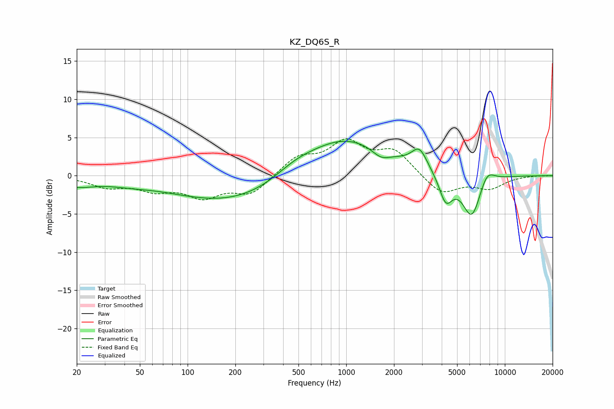

# KZ_DQ6S_R
See [usage instructions](https://github.com/jaakkopasanen/AutoEq#usage) for more options and info.

### Parametric EQs
Apply preamp of -4.6 dB when using parametric equalizer.

|   # | Type    |   Fc (Hz) |    Q |   Gain (dB) |
|-----|---------|-----------|------|-------------|
|   1 | Peaking |        20 | 1.23 |        -1.1 |
|   2 | Peaking |        42 | 1.05 |        -0.5 |
|   3 | Peaking |       206 | 0.35 |        -3.7 |
|   4 | Peaking |       469 | 1.08 |         1.2 |
|   5 | Peaking |       945 | 0.51 |         5.4 |
|   6 | Peaking |      1656 | 2.45 |        -1.2 |
|   7 | Peaking |      2892 | 2.88 |         2.6 |
|   8 | Peaking |      4245 | 3.29 |        -3.6 |
|   9 | Peaking |      6190 | 2.3  |        -5.7 |
|  10 | Peaking |      7699 | 2.83 |         2   |

### Fixed Band EQs
When using fixed band (also called graphic) equalizer, apply preamp of **-4.9 dB** (if available) and set gains manually with these parameters.

|   # | Type    |   Fc (Hz) |    Q |   Gain (dB) |
|-----|---------|-----------|------|-------------|
|   1 | Peaking |        31 | 1.41 |        -1.3 |
|   2 | Peaking |        62 | 1.41 |        -1.6 |
|   3 | Peaking |       125 | 1.41 |        -2.5 |
|   4 | Peaking |       250 | 1.41 |        -2.4 |
|   5 | Peaking |       500 | 1.41 |         2.3 |
|   6 | Peaking |      1000 | 1.41 |         4   |
|   7 | Peaking |      2000 | 1.41 |         3.1 |
|   8 | Peaking |      4000 | 1.41 |        -2.5 |
|   9 | Peaking |      8000 | 1.41 |        -1.6 |
|  10 | Peaking |     16000 | 1.41 |         0   |

### Graphs

