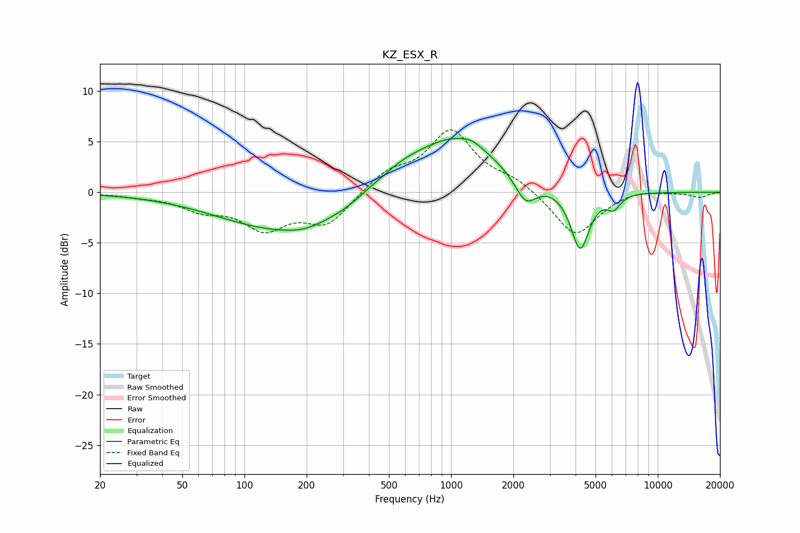

# KZ_ESX_R
See [usage instructions](https://github.com/jaakkopasanen/AutoEq#usage) for more options and info.

### Parametric EQs
Apply preamp of -5.4 dB when using parametric equalizer.

|   # | Type    |   Fc (Hz) |    Q |   Gain (dB) |
|-----|---------|-----------|------|-------------|
|   1 | Peaking |        59 | 1.34 |         0   |
|   2 | Peaking |       167 | 0.42 |        -3.9 |
|   3 | Peaking |       193 | 1.79 |        -0.3 |
|   4 | Peaking |       403 | 2.16 |         0.3 |
|   5 | Peaking |       567 | 1.19 |         1.5 |
|   6 | Peaking |      1046 | 0.7  |         5.4 |
|   7 | Peaking |      1272 | 3.06 |         0.4 |
|   8 | Peaking |      2293 | 2.76 |        -2.6 |
|   9 | Peaking |      4208 | 3.13 |        -5.9 |
|  10 | Peaking |      6113 | 4.31 |        -1.3 |

### Fixed Band EQs
When using fixed band (also called graphic) equalizer, apply preamp of **-6.3 dB** (if available) and set gains manually with these parameters.

|   # | Type    |   Fc (Hz) |    Q |   Gain (dB) |
|-----|---------|-----------|------|-------------|
|   1 | Peaking |        31 | 1.41 |        -0.3 |
|   2 | Peaking |        62 | 1.41 |        -1.5 |
|   3 | Peaking |       125 | 1.41 |        -3.3 |
|   4 | Peaking |       250 | 1.41 |        -3   |
|   5 | Peaking |       500 | 1.41 |         1.8 |
|   6 | Peaking |      1000 | 1.41 |         5.9 |
|   7 | Peaking |      2000 | 1.41 |         1.1 |
|   8 | Peaking |      4000 | 1.41 |        -4.4 |
|   9 | Peaking |      8000 | 1.41 |         0.4 |
|  10 | Peaking |     16000 | 1.41 |        -0.5 |

### Graphs

