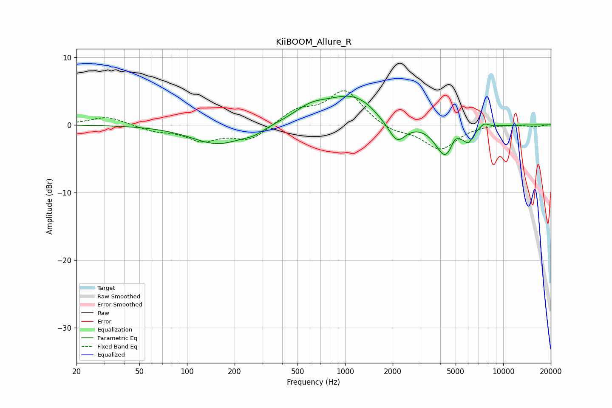

# KiiBOOM_Allure_R
See [usage instructions](https://github.com/jaakkopasanen/AutoEq#usage) for more options and info.

### Parametric EQs
Apply preamp of -4.3 dB when using parametric equalizer.

|   # | Type    |   Fc (Hz) |    Q |   Gain (dB) |
|-----|---------|-----------|------|-------------|
|   1 | Peaking |       158 | 0.84 |        -2.9 |
|   2 | Peaking |       264 | 2.33 |        -0.6 |
|   3 | Peaking |       604 | 1.3  |         1.8 |
|   4 | Peaking |      1132 | 0.82 |         4.2 |
|   5 | Peaking |      1646 | 2.52 |        -0.4 |
|   6 | Peaking |      2126 | 2.45 |        -3.6 |
|   7 | Peaking |      4291 | 2.28 |        -4.7 |
|   8 | Peaking |      4943 | 6    |         1.1 |
|   9 | Peaking |      6031 | 4.72 |        -1.8 |
|  10 | Peaking |      7592 | 4.88 |         0.7 |

### Fixed Band EQs
When using fixed band (also called graphic) equalizer, apply preamp of **-5.1 dB** (if available) and set gains manually with these parameters.

|   # | Type    |   Fc (Hz) |    Q |   Gain (dB) |
|-----|---------|-----------|------|-------------|
|   1 | Peaking |        31 | 1.41 |         1.3 |
|   2 | Peaking |        62 | 1.41 |        -0.8 |
|   3 | Peaking |       125 | 1.41 |        -2.1 |
|   4 | Peaking |       250 | 1.41 |        -2.2 |
|   5 | Peaking |       500 | 1.41 |         2   |
|   6 | Peaking |      1000 | 1.41 |         5   |
|   7 | Peaking |      2000 | 1.41 |        -1   |
|   8 | Peaking |      4000 | 1.41 |        -3.6 |
|   9 | Peaking |      8000 | 1.41 |         0.2 |
|  10 | Peaking |     16000 | 1.41 |        -0.2 |

### Graphs

