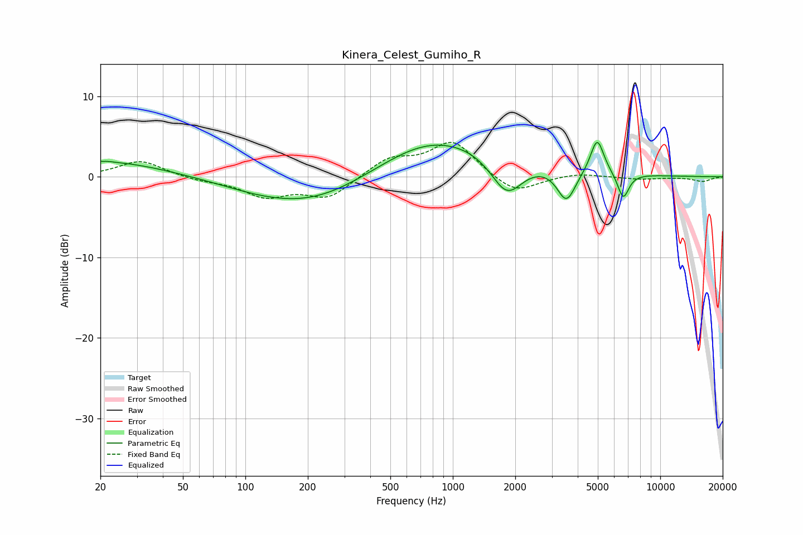

# Kinera_Celest_Gumiho_R
See [usage instructions](https://github.com/jaakkopasanen/AutoEq#usage) for more options and info.

### Parametric EQs
Apply preamp of -4.3 dB when using parametric equalizer.

|   # | Type    |   Fc (Hz) |    Q |   Gain (dB) |
|-----|---------|-----------|------|-------------|
|   1 | Peaking |        20 | 0.46 |         2   |
|   2 | Peaking |        22 | 5.95 |         0.1 |
|   3 | Peaking |       109 | 1.4  |        -0.1 |
|   4 | Peaking |       208 | 0.47 |        -4   |
|   5 | Peaking |       742 | 0.71 |         1.4 |
|   6 | Peaking |      1012 | 0.34 |         4.2 |
|   7 | Peaking |      1822 | 1.75 |        -5.2 |
|   8 | Peaking |      3529 | 3.07 |        -4.2 |
|   9 | Peaking |      4966 | 4.36 |         4.4 |
|  10 | Peaking |      6629 | 4.93 |        -3.3 |

### Fixed Band EQs
When using fixed band (also called graphic) equalizer, apply preamp of **-4.4 dB** (if available) and set gains manually with these parameters.

|   # | Type    |   Fc (Hz) |    Q |   Gain (dB) |
|-----|---------|-----------|------|-------------|
|   1 | Peaking |        31 | 1.41 |         2   |
|   2 | Peaking |        62 | 1.41 |        -0.4 |
|   3 | Peaking |       125 | 1.41 |        -2.3 |
|   4 | Peaking |       250 | 1.41 |        -2.6 |
|   5 | Peaking |       500 | 1.41 |         2.2 |
|   6 | Peaking |      1000 | 1.41 |         4.3 |
|   7 | Peaking |      2000 | 1.41 |        -2.3 |
|   8 | Peaking |      4000 | 1.41 |         0.5 |
|   9 | Peaking |      8000 | 1.41 |        -0.3 |
|  10 | Peaking |     16000 | 1.41 |        -0.6 |

### Graphs

