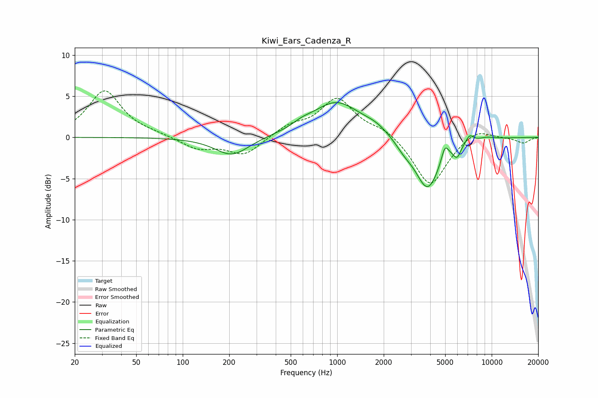

# Kiwi_Ears_Cadenza_R
See [usage instructions](https://github.com/jaakkopasanen/AutoEq#usage) for more options and info.

### Parametric EQs
Apply preamp of -4.3 dB when using parametric equalizer.

|   # | Type    |   Fc (Hz) |    Q |   Gain (dB) |
|-----|---------|-----------|------|-------------|
|   1 | Peaking |       209 | 1.29 |        -2.3 |
|   2 | Peaking |       591 | 2.37 |         0.5 |
|   3 | Peaking |       988 | 0.89 |         4.3 |
|   4 | Peaking |      1783 | 1.79 |         0.7 |
|   5 | Peaking |      2720 | 2.43 |        -0.9 |
|   6 | Peaking |      3847 | 1.75 |        -6.3 |
|   7 | Peaking |      4982 | 6    |         1.8 |
|   8 | Peaking |      5971 | 5.76 |        -1.4 |
|   9 | Peaking |      7192 | 5.23 |         1   |
|  10 | Peaking |      9261 | 2.55 |         0.3 |

### Fixed Band EQs
When using fixed band (also called graphic) equalizer, apply preamp of **-5.7 dB** (if available) and set gains manually with these parameters.

|   # | Type    |   Fc (Hz) |    Q |   Gain (dB) |
|-----|---------|-----------|------|-------------|
|   1 | Peaking |        31 | 1.41 |         5.6 |
|   2 | Peaking |        62 | 1.41 |         0.3 |
|   3 | Peaking |       125 | 1.41 |        -1.4 |
|   4 | Peaking |       250 | 1.41 |        -2.2 |
|   5 | Peaking |       500 | 1.41 |         1.3 |
|   6 | Peaking |      1000 | 1.41 |         4.6 |
|   7 | Peaking |      2000 | 1.41 |         1   |
|   8 | Peaking |      4000 | 1.41 |        -6   |
|   9 | Peaking |      8000 | 1.41 |         1.2 |
|  10 | Peaking |     16000 | 1.41 |        -0.7 |

### Graphs

