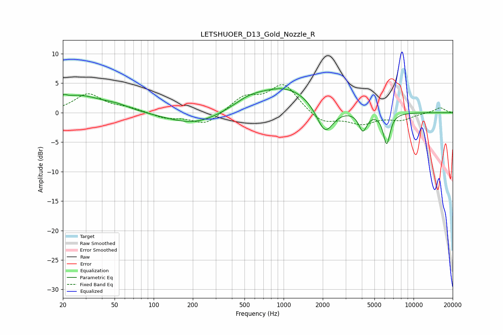

# LETSHUOER_D13_Gold_Nozzle_R
See [usage instructions](https://github.com/jaakkopasanen/AutoEq#usage) for more options and info.

### Parametric EQs
Apply preamp of -4.2 dB when using parametric equalizer.

|   # | Type    |   Fc (Hz) |    Q |   Gain (dB) |
|-----|---------|-----------|------|-------------|
|   1 | Peaking |        20 | 5.96 |        -2.2 |
|   2 | Peaking |        20 | 5.92 |         2.9 |
|   3 | Peaking |        26 | 0.81 |         2.8 |
|   4 | Peaking |        52 | 1.3  |         0.7 |
|   5 | Peaking |       206 | 0.7  |        -2.1 |
|   6 | Peaking |       537 | 1.26 |         1.2 |
|   7 | Peaking |      1042 | 0.62 |         4.3 |
|   8 | Peaking |      2080 | 2.14 |        -5.1 |
|   9 | Peaking |      4073 | 4.5  |        -3.2 |
|  10 | Peaking |      6208 | 5.16 |        -5.3 |

### Fixed Band EQs
When using fixed band (also called graphic) equalizer, apply preamp of **-4.9 dB** (if available) and set gains manually with these parameters.

|   # | Type    |   Fc (Hz) |    Q |   Gain (dB) |
|-----|---------|-----------|------|-------------|
|   1 | Peaking |        31 | 1.41 |         3.1 |
|   2 | Peaking |        62 | 1.41 |         0.7 |
|   3 | Peaking |       125 | 1.41 |        -0.9 |
|   4 | Peaking |       250 | 1.41 |        -2.1 |
|   5 | Peaking |       500 | 1.41 |         2.5 |
|   6 | Peaking |      1000 | 1.41 |         4.7 |
|   7 | Peaking |      2000 | 1.41 |        -1.9 |
|   8 | Peaking |      4000 | 1.41 |        -1.7 |
|   9 | Peaking |      8000 | 1.41 |        -1.1 |
|  10 | Peaking |     16000 | 1.41 |         0.9 |

### Graphs

