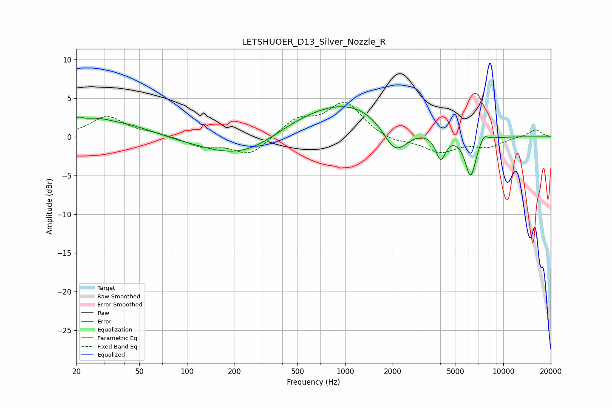

# LETSHUOER_D13_Silver_Nozzle_R
See [usage instructions](https://github.com/jaakkopasanen/AutoEq#usage) for more options and info.

### Parametric EQs
Apply preamp of -4.0 dB when using parametric equalizer.

|   # | Type    |   Fc (Hz) |    Q |   Gain (dB) |
|-----|---------|-----------|------|-------------|
|   1 | Peaking |        21 | 5.91 |         0.7 |
|   2 | Peaking |        25 | 1.09 |         1.9 |
|   3 | Peaking |        44 | 0.86 |         1.1 |
|   4 | Peaking |       228 | 0.57 |        -3   |
|   5 | Peaking |       439 | 0.83 |         0.6 |
|   6 | Peaking |      1031 | 0.46 |         4.7 |
|   7 | Peaking |      2077 | 1.74 |        -4.3 |
|   8 | Peaking |      4020 | 4.57 |        -3.2 |
|   9 | Peaking |      6218 | 3.92 |        -5.3 |
|  10 | Peaking |      7535 | 5.08 |         1   |

### Fixed Band EQs
When using fixed band (also called graphic) equalizer, apply preamp of **-4.6 dB** (if available) and set gains manually with these parameters.

|   # | Type    |   Fc (Hz) |    Q |   Gain (dB) |
|-----|---------|-----------|------|-------------|
|   1 | Peaking |        31 | 1.41 |         2.6 |
|   2 | Peaking |        62 | 1.41 |         0.4 |
|   3 | Peaking |       125 | 1.41 |        -1.2 |
|   4 | Peaking |       250 | 1.41 |        -2.4 |
|   5 | Peaking |       500 | 1.41 |         2.2 |
|   6 | Peaking |      1000 | 1.41 |         4.4 |
|   7 | Peaking |      2000 | 1.41 |        -0.7 |
|   8 | Peaking |      4000 | 1.41 |        -1.9 |
|   9 | Peaking |      8000 | 1.41 |        -1.2 |
|  10 | Peaking |     16000 | 1.41 |         1   |

### Graphs

