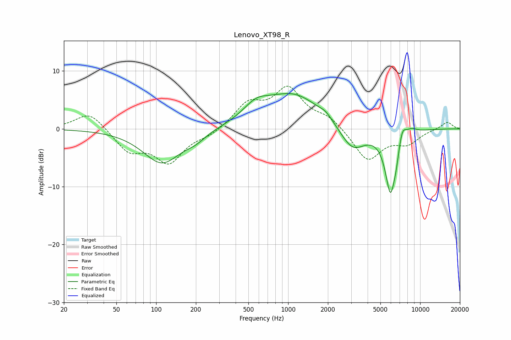

# Lenovo_XT98_R
See [usage instructions](https://github.com/jaakkopasanen/AutoEq#usage) for more options and info.

### Parametric EQs
Apply preamp of -6.2 dB when using parametric equalizer.

|   # | Type    |   Fc (Hz) |    Q |   Gain (dB) |
|-----|---------|-----------|------|-------------|
|   1 | Peaking |       111 | 0.98 |        -5.9 |
|   2 | Peaking |       199 | 1.9  |        -1.1 |
|   3 | Peaking |       572 | 1.45 |         2.4 |
|   4 | Peaking |      1101 | 0.64 |         5.9 |
|   5 | Peaking |      1932 | 3.19 |         0.8 |
|   6 | Peaking |      3068 | 1.43 |        -4.4 |
|   7 | Peaking |      5954 | 3.36 |       -10.6 |
|   8 | Peaking |      6574 | 6    |        -1.7 |
|   9 | Peaking |      7315 | 4.67 |         2.7 |
|  10 | Peaking |      8550 | 3.22 |         0.8 |

### Fixed Band EQs
When using fixed band (also called graphic) equalizer, apply preamp of **-7.5 dB** (if available) and set gains manually with these parameters.

|   # | Type    |   Fc (Hz) |    Q |   Gain (dB) |
|-----|---------|-----------|------|-------------|
|   1 | Peaking |        31 | 1.41 |         3   |
|   2 | Peaking |        62 | 1.41 |        -3.7 |
|   3 | Peaking |       125 | 1.41 |        -5.5 |
|   4 | Peaking |       250 | 1.41 |        -1   |
|   5 | Peaking |       500 | 1.41 |         4   |
|   6 | Peaking |      1000 | 1.41 |         6.6 |
|   7 | Peaking |      2000 | 1.41 |         1.8 |
|   8 | Peaking |      4000 | 1.41 |        -5.5 |
|   9 | Peaking |      8000 | 1.41 |        -2.3 |
|  10 | Peaking |     16000 | 1.41 |         1.3 |

### Graphs

