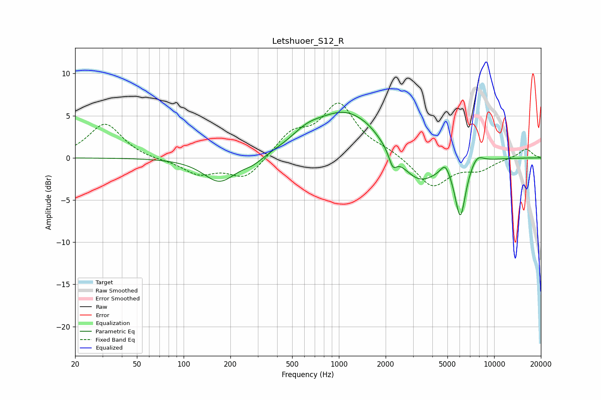

# Letshuoer_S12_R
See [usage instructions](https://github.com/jaakkopasanen/AutoEq#usage) for more options and info.

### Parametric EQs
Apply preamp of -5.5 dB when using parametric equalizer.

|   # | Type    |   Fc (Hz) |    Q |   Gain (dB) |
|-----|---------|-----------|------|-------------|
|   1 | Peaking |       171 | 1.36 |        -3   |
|   2 | Peaking |       280 | 2.06 |        -0.7 |
|   3 | Peaking |       622 | 1.42 |         1.3 |
|   4 | Peaking |      1119 | 0.7  |         5.4 |
|   5 | Peaking |      1549 | 2.34 |         0.3 |
|   6 | Peaking |      2224 | 5.58 |        -1.7 |
|   7 | Peaking |      3246 | 1.14 |        -3.5 |
|   8 | Peaking |      4841 | 4.81 |         1.4 |
|   9 | Peaking |      6054 | 3.98 |        -6.6 |
|  10 | Peaking |      7756 | 3.18 |         1.1 |

### Fixed Band EQs
When using fixed band (also called graphic) equalizer, apply preamp of **-6.6 dB** (if available) and set gains manually with these parameters.

|   # | Type    |   Fc (Hz) |    Q |   Gain (dB) |
|-----|---------|-----------|------|-------------|
|   1 | Peaking |        31 | 1.41 |         4.1 |
|   2 | Peaking |        62 | 1.41 |        -0.2 |
|   3 | Peaking |       125 | 1.41 |        -1.8 |
|   4 | Peaking |       250 | 1.41 |        -2.5 |
|   5 | Peaking |       500 | 1.41 |         2.7 |
|   6 | Peaking |      1000 | 1.41 |         6.1 |
|   7 | Peaking |      2000 | 1.41 |         0.7 |
|   8 | Peaking |      4000 | 1.41 |        -3.5 |
|   9 | Peaking |      8000 | 1.41 |        -1.3 |
|  10 | Peaking |     16000 | 1.41 |         1.1 |

### Graphs

