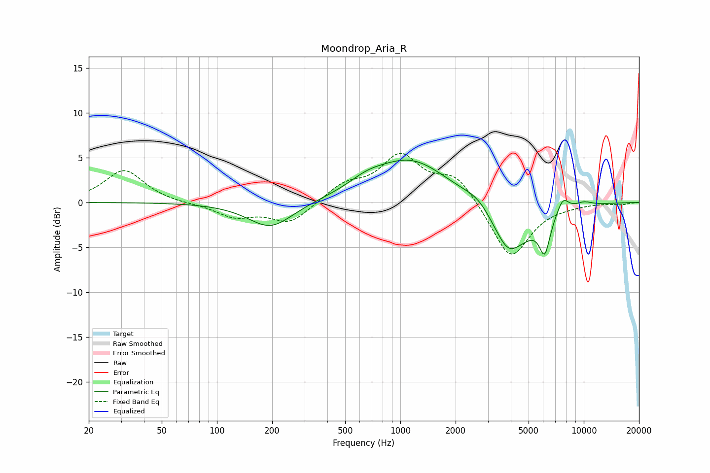

# Moondrop_Aria_R
See [usage instructions](https://github.com/jaakkopasanen/AutoEq#usage) for more options and info.

### Parametric EQs
Apply preamp of -4.8 dB when using parametric equalizer.

|   # | Type    |   Fc (Hz) |    Q |   Gain (dB) |
|-----|---------|-----------|------|-------------|
|   1 | Peaking |       196 | 1.15 |        -2.9 |
|   2 | Peaking |       655 | 1.45 |         0.9 |
|   3 | Peaking |      1147 | 0.68 |         4.8 |
|   4 | Peaking |      2710 | 1.58 |         1.6 |
|   5 | Peaking |      2908 | 1.64 |         0.3 |
|   6 | Peaking |      3869 | 3.25 |        -0.7 |
|   7 | Peaking |      3889 | 1.06 |        -6   |
|   8 | Peaking |      6127 | 4.73 |        -3.8 |
|   9 | Peaking |      7685 | 4.01 |         1.7 |
|  10 | Peaking |     10000 | 2.52 |         0.5 |

### Fixed Band EQs
When using fixed band (also called graphic) equalizer, apply preamp of **-5.6 dB** (if available) and set gains manually with these parameters.

|   # | Type    |   Fc (Hz) |    Q |   Gain (dB) |
|-----|---------|-----------|------|-------------|
|   1 | Peaking |        31 | 1.41 |         3.6 |
|   2 | Peaking |        62 | 1.41 |        -0.1 |
|   3 | Peaking |       125 | 1.41 |        -1.5 |
|   4 | Peaking |       250 | 1.41 |        -2.3 |
|   5 | Peaking |       500 | 1.41 |         1.8 |
|   6 | Peaking |      1000 | 1.41 |         4.9 |
|   7 | Peaking |      2000 | 1.41 |         2.9 |
|   8 | Peaking |      4000 | 1.41 |        -6.4 |
|   9 | Peaking |      8000 | 1.41 |        -0.2 |
|  10 | Peaking |     16000 | 1.41 |        -0.2 |

### Graphs

