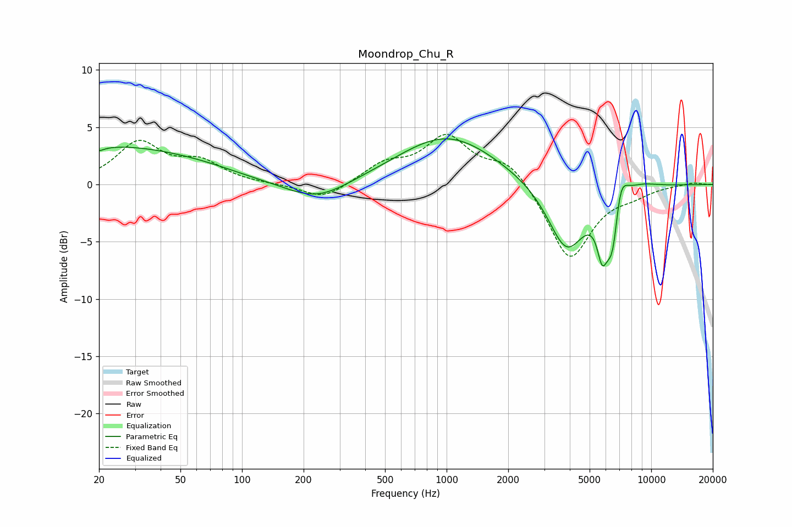

# Moondrop_Chu_R
See [usage instructions](https://github.com/jaakkopasanen/AutoEq#usage) for more options and info.

### Parametric EQs
Apply preamp of -4.1 dB when using parametric equalizer.

|   # | Type    |   Fc (Hz) |    Q |   Gain (dB) |
|-----|---------|-----------|------|-------------|
|   1 | Peaking |        20 | 5.99 |        -0.3 |
|   2 | Peaking |        24 | 0.36 |         3.2 |
|   3 | Peaking |        66 | 0.83 |         0.3 |
|   4 | Peaking |       232 | 0.92 |        -1.7 |
|   5 | Peaking |      1009 | 0.59 |         4.3 |
|   6 | Peaking |      3854 | 1.51 |        -5.9 |
|   7 | Peaking |      5754 | 5.58 |        -3.3 |
|   8 | Peaking |      6520 | 3.61 |        -7.3 |
|   9 | Peaking |      6972 | 3.69 |         4.9 |
|  10 | Peaking |      8759 | 1.54 |         0.5 |

### Fixed Band EQs
When using fixed band (also called graphic) equalizer, apply preamp of **-4.5 dB** (if available) and set gains manually with these parameters.

|   # | Type    |   Fc (Hz) |    Q |   Gain (dB) |
|-----|---------|-----------|------|-------------|
|   1 | Peaking |        31 | 1.41 |         3.5 |
|   2 | Peaking |        62 | 1.41 |         1.8 |
|   3 | Peaking |       125 | 1.41 |         0   |
|   4 | Peaking |       250 | 1.41 |        -1.4 |
|   5 | Peaking |       500 | 1.41 |         1.6 |
|   6 | Peaking |      1000 | 1.41 |         4   |
|   7 | Peaking |      2000 | 1.41 |         2.1 |
|   8 | Peaking |      4000 | 1.41 |        -6.7 |
|   9 | Peaking |      8000 | 1.41 |        -0.6 |
|  10 | Peaking |     16000 | 1.41 |         0.2 |

### Graphs

