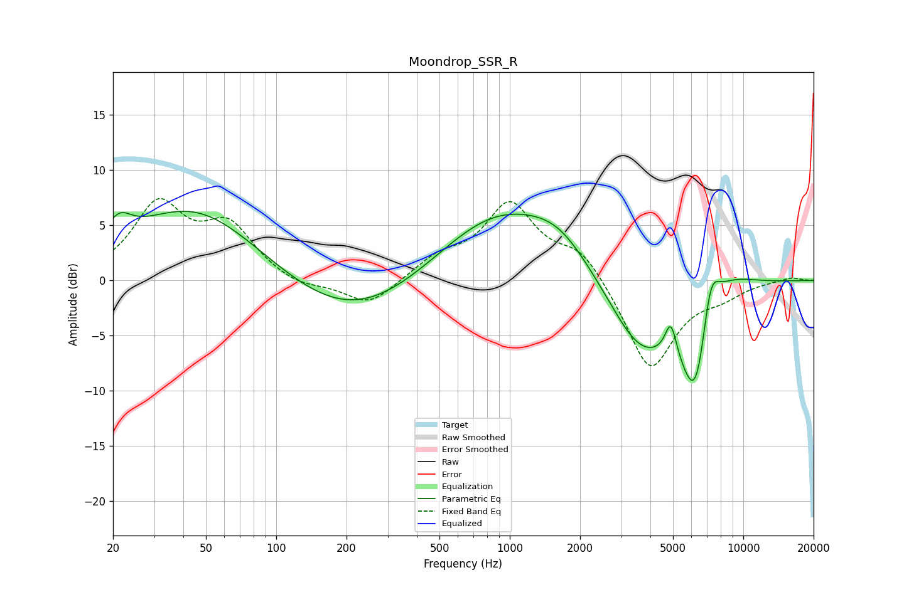

# Moondrop_SSR_R
See [usage instructions](https://github.com/jaakkopasanen/AutoEq#usage) for more options and info.

### Parametric EQs
Apply preamp of -6.4 dB when using parametric equalizer.

|   # | Type    |   Fc (Hz) |    Q |   Gain (dB) |
|-----|---------|-----------|------|-------------|
|   1 | Peaking |        21 | 2.71 |         2.1 |
|   2 | Peaking |        45 | 0.49 |         6.8 |
|   3 | Peaking |       213 | 0.47 |        -4.3 |
|   4 | Peaking |       882 | 0.52 |         6.4 |
|   5 | Peaking |      1633 | 1.05 |         2.4 |
|   6 | Peaking |      3627 | 0.97 |        -6.5 |
|   7 | Peaking |      4894 | 5.68 |         3.1 |
|   8 | Peaking |      6294 | 1.94 |       -11.1 |
|   9 | Peaking |      7209 | 3.25 |         5.7 |
|  10 | Peaking |      8261 | 1.14 |         2.6 |

### Fixed Band EQs
When using fixed band (also called graphic) equalizer, apply preamp of **-7.5 dB** (if available) and set gains manually with these parameters.

|   # | Type    |   Fc (Hz) |    Q |   Gain (dB) |
|-----|---------|-----------|------|-------------|
|   1 | Peaking |        31 | 1.41 |         6.6 |
|   2 | Peaking |        62 | 1.41 |         4.5 |
|   3 | Peaking |       125 | 1.41 |        -0.8 |
|   4 | Peaking |       250 | 1.41 |        -2.4 |
|   5 | Peaking |       500 | 1.41 |         1.8 |
|   6 | Peaking |      1000 | 1.41 |         6.7 |
|   7 | Peaking |      2000 | 1.41 |         2.7 |
|   8 | Peaking |      4000 | 1.41 |        -8.3 |
|   9 | Peaking |      8000 | 1.41 |        -1.1 |
|  10 | Peaking |     16000 | 1.41 |         0.3 |

### Graphs

