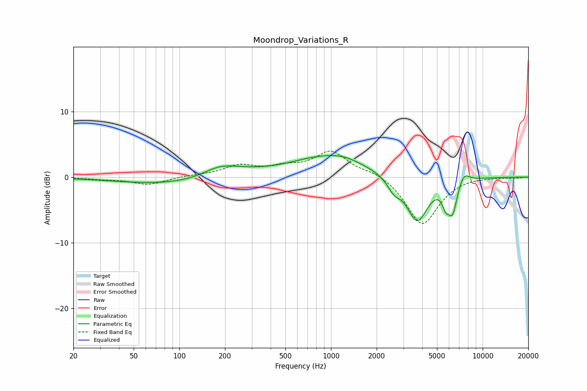

# Moondrop_Variations_R
See [usage instructions](https://github.com/jaakkopasanen/AutoEq#usage) for more options and info.

### Parametric EQs
Apply preamp of -3.4 dB when using parametric equalizer.

|   # | Type    |   Fc (Hz) |    Q |   Gain (dB) |
|-----|---------|-----------|------|-------------|
|   1 | Peaking |       100 | 0.36 |        -1.2 |
|   2 | Peaking |       186 | 1.18 |         1.8 |
|   3 | Peaking |       270 | 0.83 |         0.6 |
|   4 | Peaking |       956 | 0.57 |         3.1 |
|   5 | Peaking |      1226 | 1.52 |         0.4 |
|   6 | Peaking |      2604 | 3.39 |        -1.7 |
|   7 | Peaking |      3704 | 2    |        -6.8 |
|   8 | Peaking |      5701 | 6    |        -2.2 |
|   9 | Peaking |      6330 | 4.51 |        -4.6 |
|  10 | Peaking |      7534 | 3.84 |         1.6 |

### Fixed Band EQs
When using fixed band (also called graphic) equalizer, apply preamp of **-4.1 dB** (if available) and set gains manually with these parameters.

|   # | Type    |   Fc (Hz) |    Q |   Gain (dB) |
|-----|---------|-----------|------|-------------|
|   1 | Peaking |        31 | 1.41 |        -0.3 |
|   2 | Peaking |        62 | 1.41 |        -1.1 |
|   3 | Peaking |       125 | 1.41 |         0.2 |
|   4 | Peaking |       250 | 1.41 |         1.6 |
|   5 | Peaking |       500 | 1.41 |         1.2 |
|   6 | Peaking |      1000 | 1.41 |         3.8 |
|   7 | Peaking |      2000 | 1.41 |         0.9 |
|   8 | Peaking |      4000 | 1.41 |        -7.4 |
|   9 | Peaking |      8000 | 1.41 |         0.2 |
|  10 | Peaking |     16000 | 1.41 |        -0.1 |

### Graphs

