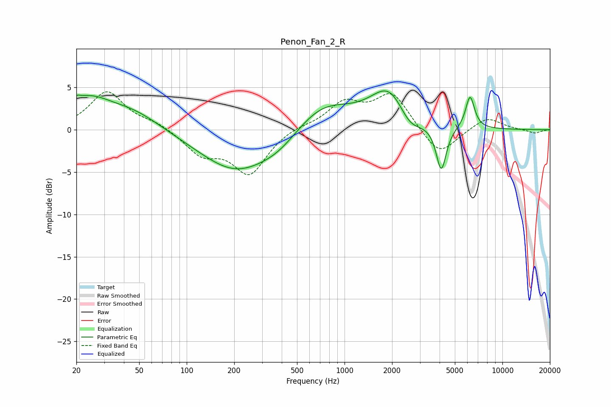

# Penon_Fan_2_R
See [usage instructions](https://github.com/jaakkopasanen/AutoEq#usage) for more options and info.

### Parametric EQs
Apply preamp of -4.7 dB when using parametric equalizer.

|   # | Type    |   Fc (Hz) |    Q |   Gain (dB) |
|-----|---------|-----------|------|-------------|
|   1 | Peaking |        20 | 5.98 |         0.5 |
|   2 | Peaking |        23 | 0.9  |         3.4 |
|   3 | Peaking |        47 | 0.83 |         1.8 |
|   4 | Peaking |       206 | 0.61 |        -4.9 |
|   5 | Peaking |       388 | 1.07 |        -1.4 |
|   6 | Peaking |       717 | 0.76 |         3.4 |
|   7 | Peaking |      1939 | 1.18 |         4.9 |
|   8 | Peaking |      2574 | 1.85 |        -2.3 |
|   9 | Peaking |      4100 | 4.37 |        -5.4 |
|  10 | Peaking |      6240 | 4.89 |         3.9 |

### Fixed Band EQs
When using fixed band (also called graphic) equalizer, apply preamp of **-4.6 dB** (if available) and set gains manually with these parameters.

|   # | Type    |   Fc (Hz) |    Q |   Gain (dB) |
|-----|---------|-----------|------|-------------|
|   1 | Peaking |        31 | 1.41 |         4.5 |
|   2 | Peaking |        62 | 1.41 |         0.8 |
|   3 | Peaking |       125 | 1.41 |        -2.7 |
|   4 | Peaking |       250 | 1.41 |        -5.1 |
|   5 | Peaking |       500 | 1.41 |         0.4 |
|   6 | Peaking |      1000 | 1.41 |         3   |
|   7 | Peaking |      2000 | 1.41 |         4.2 |
|   8 | Peaking |      4000 | 1.41 |        -3.3 |
|   9 | Peaking |      8000 | 1.41 |         1.5 |
|  10 | Peaking |     16000 | 1.41 |        -0.4 |

### Graphs

