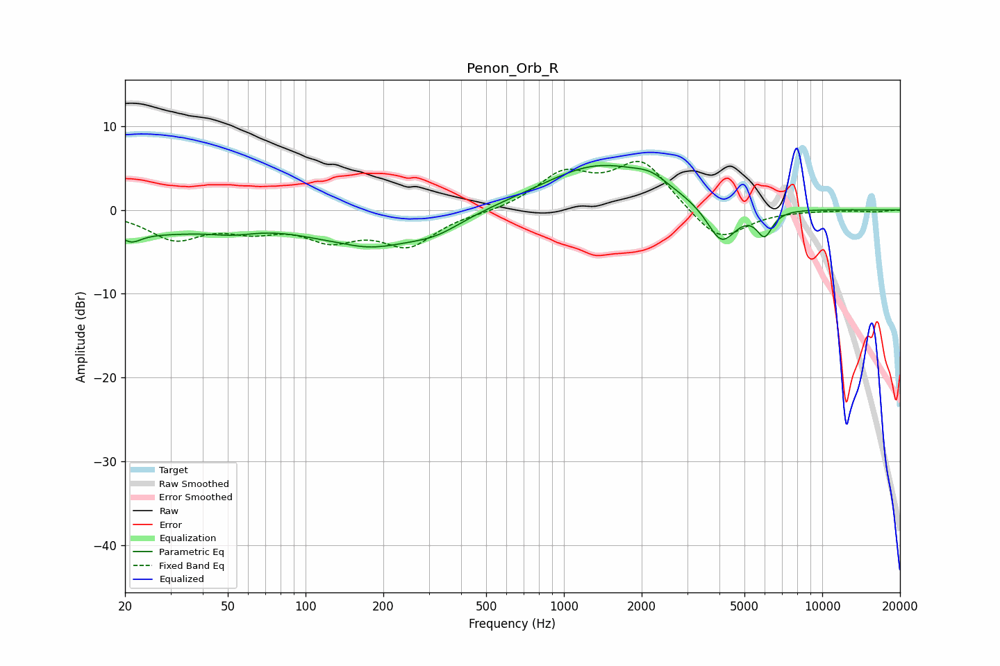

# Penon_Orb_R
See [usage instructions](https://github.com/jaakkopasanen/AutoEq#usage) for more options and info.

### Parametric EQs
Apply preamp of -5.4 dB when using parametric equalizer.

|   # | Type    |   Fc (Hz) |    Q |   Gain (dB) |
|-----|---------|-----------|------|-------------|
|   1 | Peaking |        21 | 3.79 |        -1.1 |
|   2 | Peaking |        23 | 0.46 |        -2.5 |
|   3 | Peaking |        52 | 1.69 |        -0.7 |
|   4 | Peaking |       139 | 2.03 |         0.3 |
|   5 | Peaking |       171 | 0.69 |        -4.2 |
|   6 | Peaking |       321 | 1.34 |        -1.5 |
|   7 | Peaking |      1370 | 0.64 |         5.4 |
|   8 | Peaking |      2169 | 2.23 |         1.1 |
|   9 | Peaking |      4071 | 2.45 |        -4.7 |
|  10 | Peaking |      5983 | 4.52 |        -3   |

### Fixed Band EQs
When using fixed band (also called graphic) equalizer, apply preamp of **-5.9 dB** (if available) and set gains manually with these parameters.

|   # | Type    |   Fc (Hz) |    Q |   Gain (dB) |
|-----|---------|-----------|------|-------------|
|   1 | Peaking |        31 | 1.41 |        -3.2 |
|   2 | Peaking |        62 | 1.41 |        -1.9 |
|   3 | Peaking |       125 | 1.41 |        -3   |
|   4 | Peaking |       250 | 1.41 |        -4   |
|   5 | Peaking |       500 | 1.41 |        -0.3 |
|   6 | Peaking |      1000 | 1.41 |         4.1 |
|   7 | Peaking |      2000 | 1.41 |         5.7 |
|   8 | Peaking |      4000 | 1.41 |        -4   |
|   9 | Peaking |      8000 | 1.41 |        -0   |
|  10 | Peaking |     16000 | 1.41 |        -0.2 |

### Graphs

