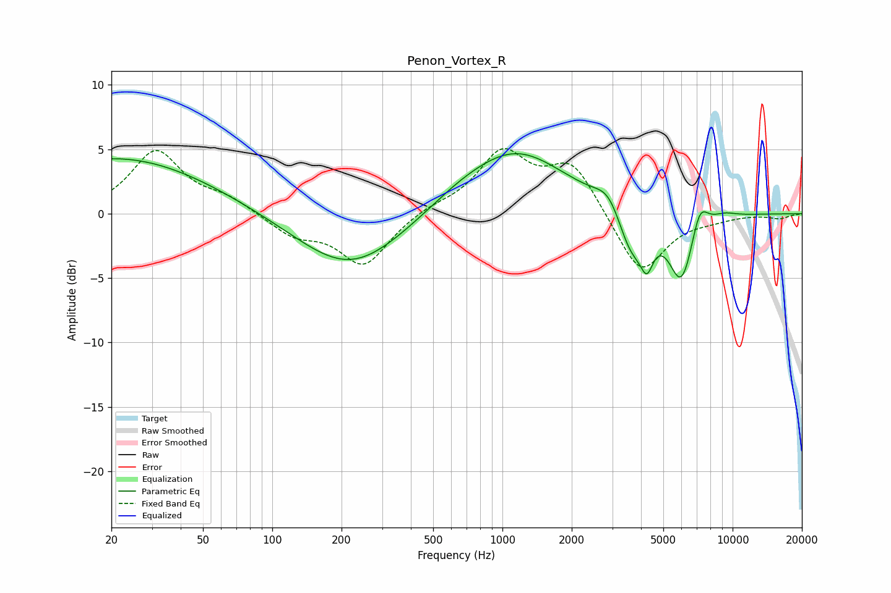

# Penon_Vortex_R
See [usage instructions](https://github.com/jaakkopasanen/AutoEq#usage) for more options and info.

### Parametric EQs
Apply preamp of -4.8 dB when using parametric equalizer.

|   # | Type    |   Fc (Hz) |    Q |   Gain (dB) |
|-----|---------|-----------|------|-------------|
|   1 | Peaking |        21 | 0.35 |         4.4 |
|   2 | Peaking |       218 | 0.61 |        -4.4 |
|   3 | Peaking |       636 | 0.97 |         0.6 |
|   4 | Peaking |      1139 | 0.64 |         4.9 |
|   5 | Peaking |      2899 | 2.45 |         1.5 |
|   6 | Peaking |      3618 | 2.33 |        -3.4 |
|   7 | Peaking |      4242 | 4.94 |        -2.6 |
|   8 | Peaking |      5997 | 2.46 |        -5.4 |
|   9 | Peaking |      7188 | 3.75 |         2.3 |
|  10 | Peaking |      9205 | 2.51 |         0.3 |

### Fixed Band EQs
When using fixed band (also called graphic) equalizer, apply preamp of **-5.1 dB** (if available) and set gains manually with these parameters.

|   # | Type    |   Fc (Hz) |    Q |   Gain (dB) |
|-----|---------|-----------|------|-------------|
|   1 | Peaking |        31 | 1.41 |         4.8 |
|   2 | Peaking |        62 | 1.41 |         1   |
|   3 | Peaking |       125 | 1.41 |        -1.6 |
|   4 | Peaking |       250 | 1.41 |        -4   |
|   5 | Peaking |       500 | 1.41 |         0.5 |
|   6 | Peaking |      1000 | 1.41 |         4.6 |
|   7 | Peaking |      2000 | 1.41 |         3.8 |
|   8 | Peaking |      4000 | 1.41 |        -4.9 |
|   9 | Peaking |      8000 | 1.41 |        -0.3 |
|  10 | Peaking |     16000 | 1.41 |        -0.3 |

### Graphs

