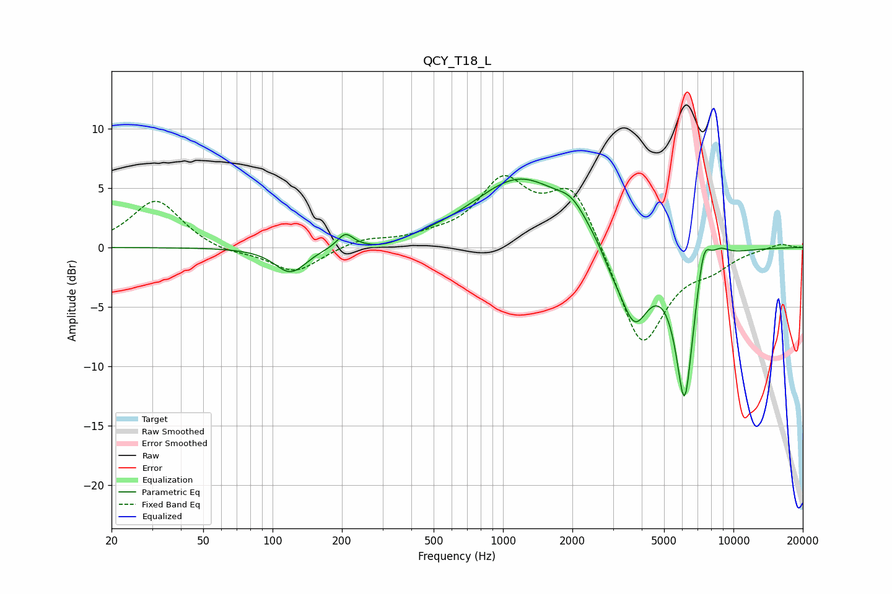

# QCY_T18_L
See [usage instructions](https://github.com/jaakkopasanen/AutoEq#usage) for more options and info.

### Parametric EQs
Apply preamp of -5.9 dB when using parametric equalizer.

|   # | Type    |   Fc (Hz) |    Q |   Gain (dB) |
|-----|---------|-----------|------|-------------|
|   1 | Peaking |       120 | 2.07 |        -2.2 |
|   2 | Peaking |       207 | 4.11 |         1.2 |
|   3 | Peaking |       303 | 1.7  |        -0.5 |
|   4 | Peaking |      1189 | 0.69 |         5.8 |
|   5 | Peaking |      1991 | 2.22 |         1.4 |
|   6 | Peaking |      2961 | 3.04 |        -1   |
|   7 | Peaking |      3708 | 2.12 |        -6.3 |
|   8 | Peaking |      6138 | 3.36 |       -12.7 |
|   9 | Peaking |      7428 | 4.55 |         3.4 |
|  10 | Peaking |      8729 | 3.21 |         0.9 |

### Fixed Band EQs
When using fixed band (also called graphic) equalizer, apply preamp of **-6.1 dB** (if available) and set gains manually with these parameters.

|   # | Type    |   Fc (Hz) |    Q |   Gain (dB) |
|-----|---------|-----------|------|-------------|
|   1 | Peaking |        31 | 1.41 |         4   |
|   2 | Peaking |        62 | 1.41 |        -0.5 |
|   3 | Peaking |       125 | 1.41 |        -2.1 |
|   4 | Peaking |       250 | 1.41 |         0.7 |
|   5 | Peaking |       500 | 1.41 |         0.6 |
|   6 | Peaking |      1000 | 1.41 |         5.3 |
|   7 | Peaking |      2000 | 1.41 |         5.4 |
|   8 | Peaking |      4000 | 1.41 |        -8.7 |
|   9 | Peaking |      8000 | 1.41 |        -1.3 |
|  10 | Peaking |     16000 | 1.41 |         0.4 |

### Graphs

