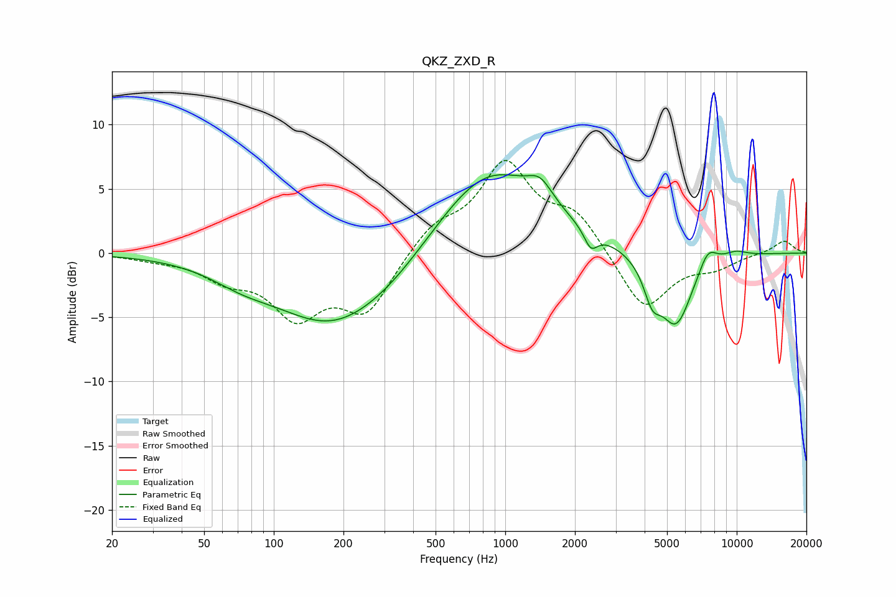

# QKZ_ZXD_R
See [usage instructions](https://github.com/jaakkopasanen/AutoEq#usage) for more options and info.

### Parametric EQs
Apply preamp of -6.2 dB when using parametric equalizer.

|   # | Type    |   Fc (Hz) |    Q |   Gain (dB) |
|-----|---------|-----------|------|-------------|
|   1 | Peaking |        73 | 1.04 |        -1   |
|   2 | Peaking |       177 | 0.57 |        -5.3 |
|   3 | Peaking |       328 | 0.76 |        -1.3 |
|   4 | Peaking |       852 | 0.6  |         6.8 |
|   5 | Peaking |      1416 | 2.6  |         1.6 |
|   6 | Peaking |      2342 | 4.88 |        -1.5 |
|   7 | Peaking |      4314 | 3.81 |        -2.4 |
|   8 | Peaking |      5467 | 1.92 |        -5.7 |
|   9 | Peaking |      7503 | 3.41 |         1.5 |
|  10 | Peaking |      9907 | 2.6  |         0.4 |

### Fixed Band EQs
When using fixed band (also called graphic) equalizer, apply preamp of **-7.3 dB** (if available) and set gains manually with these parameters.

|   # | Type    |   Fc (Hz) |    Q |   Gain (dB) |
|-----|---------|-----------|------|-------------|
|   1 | Peaking |        31 | 1.41 |        -0.3 |
|   2 | Peaking |        62 | 1.41 |        -1.7 |
|   3 | Peaking |       125 | 1.41 |        -4.5 |
|   4 | Peaking |       250 | 1.41 |        -4.4 |
|   5 | Peaking |       500 | 1.41 |         2   |
|   6 | Peaking |      1000 | 1.41 |         6.7 |
|   7 | Peaking |      2000 | 1.41 |         2.8 |
|   8 | Peaking |      4000 | 1.41 |        -4.6 |
|   9 | Peaking |      8000 | 1.41 |        -1   |
|  10 | Peaking |     16000 | 1.41 |         1   |

### Graphs

