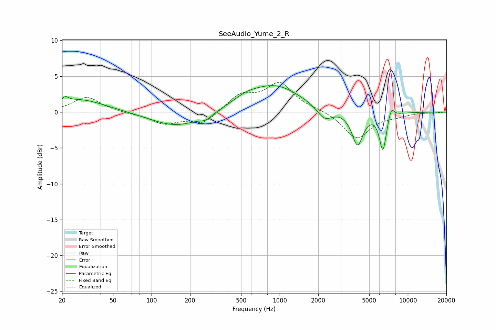

# SeeAudio_Yume_2_R
See [usage instructions](https://github.com/jaakkopasanen/AutoEq#usage) for more options and info.

### Parametric EQs
Apply preamp of -3.8 dB when using parametric equalizer.

|   # | Type    |   Fc (Hz) |    Q |   Gain (dB) |
|-----|---------|-----------|------|-------------|
|   1 | Peaking |        21 | 5.94 |         0.6 |
|   2 | Peaking |        27 | 0.7  |         1.8 |
|   3 | Peaking |       157 | 0.71 |        -2.1 |
|   4 | Peaking |       266 | 3.13 |        -0.6 |
|   5 | Peaking |       540 | 1.36 |         0.9 |
|   6 | Peaking |       925 | 0.7  |         3.6 |
|   7 | Peaking |      2240 | 2.4  |        -1.8 |
|   8 | Peaking |      4047 | 3.23 |        -4.6 |
|   9 | Peaking |      6388 | 5.02 |        -5.2 |
|  10 | Peaking |      7432 | 5.89 |         1.5 |

### Fixed Band EQs
When using fixed band (also called graphic) equalizer, apply preamp of **-4.2 dB** (if available) and set gains manually with these parameters.

|   # | Type    |   Fc (Hz) |    Q |   Gain (dB) |
|-----|---------|-----------|------|-------------|
|   1 | Peaking |        31 | 1.41 |         2.1 |
|   2 | Peaking |        62 | 1.41 |        -0.1 |
|   3 | Peaking |       125 | 1.41 |        -1.5 |
|   4 | Peaking |       250 | 1.41 |        -1.7 |
|   5 | Peaking |       500 | 1.41 |         2.3 |
|   6 | Peaking |      1000 | 1.41 |         3.9 |
|   7 | Peaking |      2000 | 1.41 |         0.3 |
|   8 | Peaking |      4000 | 1.41 |        -3.7 |
|   9 | Peaking |      8000 | 1.41 |        -0.4 |
|  10 | Peaking |     16000 | 1.41 |        -0.1 |

### Graphs

