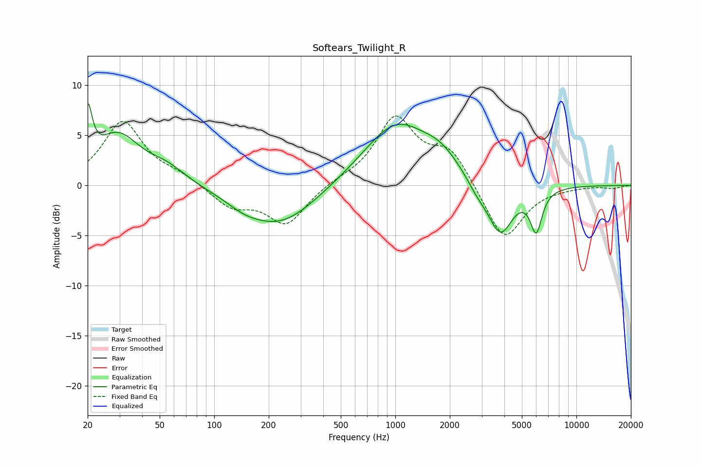

# Softears_Twilight_R
See [usage instructions](https://github.com/jaakkopasanen/AutoEq#usage) for more options and info.

### Parametric EQs
Apply preamp of -8.3 dB when using parametric equalizer.

|   # | Type    |   Fc (Hz) |    Q |   Gain (dB) |
|-----|---------|-----------|------|-------------|
|   1 | Peaking |        20 | 5.89 |         5.4 |
|   2 | Peaking |        29 | 1.14 |         4.8 |
|   3 | Peaking |        55 | 1.33 |         1.4 |
|   4 | Peaking |       146 | 1.56 |        -0.7 |
|   5 | Peaking |       230 | 0.71 |        -4   |
|   6 | Peaking |      1009 | 0.77 |         6.2 |
|   7 | Peaking |      1789 | 1.37 |         1.7 |
|   8 | Peaking |      2838 | 2.5  |        -1   |
|   9 | Peaking |      3801 | 2.01 |        -5.1 |
|  10 | Peaking |      5998 | 4.29 |        -4.1 |

### Fixed Band EQs
When using fixed band (also called graphic) equalizer, apply preamp of **-7.0 dB** (if available) and set gains manually with these parameters.

|   # | Type    |   Fc (Hz) |    Q |   Gain (dB) |
|-----|---------|-----------|------|-------------|
|   1 | Peaking |        31 | 1.41 |         6.3 |
|   2 | Peaking |        62 | 1.41 |         0.9 |
|   3 | Peaking |       125 | 1.41 |        -2.1 |
|   4 | Peaking |       250 | 1.41 |        -3.8 |
|   5 | Peaking |       500 | 1.41 |         0.4 |
|   6 | Peaking |      1000 | 1.41 |         6.6 |
|   7 | Peaking |      2000 | 1.41 |         3.4 |
|   8 | Peaking |      4000 | 1.41 |        -5.7 |
|   9 | Peaking |      8000 | 1.41 |        -0.1 |
|  10 | Peaking |     16000 | 1.41 |        -0.3 |

### Graphs

