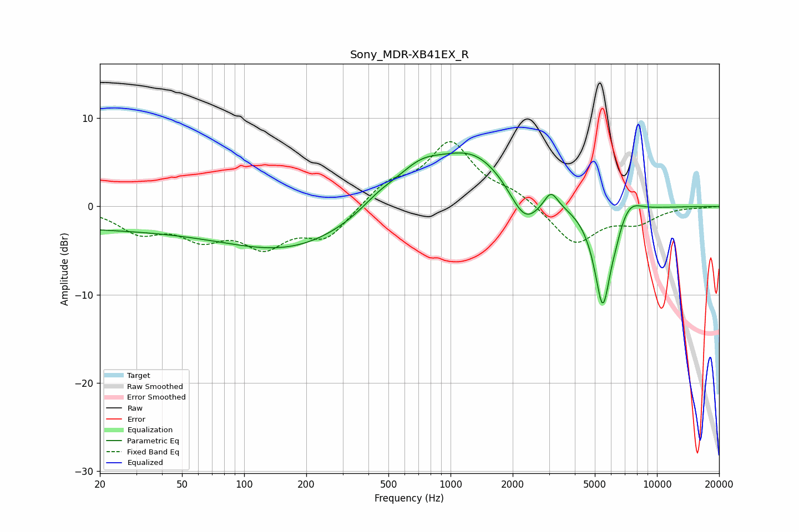

# Sony_MDR-XB41EX_R
See [usage instructions](https://github.com/jaakkopasanen/AutoEq#usage) for more options and info.

### Parametric EQs
Apply preamp of -6.2 dB when using parametric equalizer.

|   # | Type    |   Fc (Hz) |    Q |   Gain (dB) |
|-----|---------|-----------|------|-------------|
|   1 | Peaking |        23 | 0.18 |        -2.4 |
|   2 | Peaking |       178 | 0.47 |        -4   |
|   3 | Peaking |       451 | 1.47 |         1.4 |
|   4 | Peaking |       709 | 1.22 |         3   |
|   5 | Peaking |      1297 | 0.76 |         5.9 |
|   6 | Peaking |      2289 | 1.89 |        -4.1 |
|   7 | Peaking |      3064 | 4.25 |         1.9 |
|   8 | Peaking |      5464 | 3.24 |       -11.7 |
|   9 | Peaking |      6312 | 5.96 |        -0.6 |
|  10 | Peaking |      7357 | 2.45 |         1.7 |

### Fixed Band EQs
When using fixed band (also called graphic) equalizer, apply preamp of **-7.4 dB** (if available) and set gains manually with these parameters.

|   # | Type    |   Fc (Hz) |    Q |   Gain (dB) |
|-----|---------|-----------|------|-------------|
|   1 | Peaking |        31 | 1.41 |        -2.6 |
|   2 | Peaking |        62 | 1.41 |        -3   |
|   3 | Peaking |       125 | 1.41 |        -4   |
|   4 | Peaking |       250 | 1.41 |        -3.4 |
|   5 | Peaking |       500 | 1.41 |         2.4 |
|   6 | Peaking |      1000 | 1.41 |         7   |
|   7 | Peaking |      2000 | 1.41 |         1.3 |
|   8 | Peaking |      4000 | 1.41 |        -4.3 |
|   9 | Peaking |      8000 | 1.41 |        -1.7 |
|  10 | Peaking |     16000 | 1.41 |        -0.1 |

### Graphs

