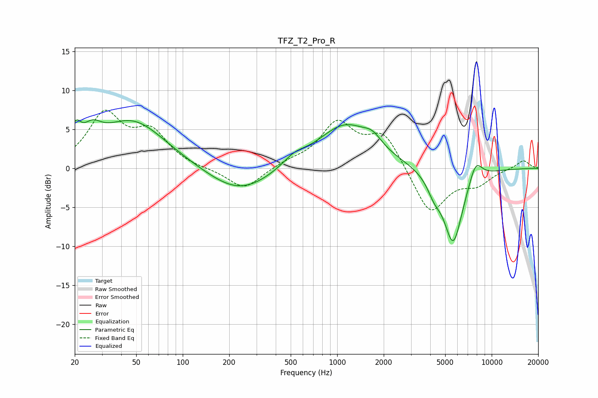

# TFZ_T2_Pro_R
See [usage instructions](https://github.com/jaakkopasanen/AutoEq#usage) for more options and info.

### Parametric EQs
Apply preamp of -6.3 dB when using parametric equalizer.

|   # | Type    |   Fc (Hz) |    Q |   Gain (dB) |
|-----|---------|-----------|------|-------------|
|   1 | Peaking |        20 | 4.32 |         2.8 |
|   2 | Peaking |        26 | 2.38 |         2.2 |
|   3 | Peaking |        47 | 0.65 |         6.1 |
|   4 | Peaking |       232 | 0.69 |        -3.4 |
|   5 | Peaking |       526 | 1.94 |         1.1 |
|   6 | Peaking |      1125 | 0.79 |         5.6 |
|   7 | Peaking |      1693 | 2.46 |         1.3 |
|   8 | Peaking |      4243 | 3.16 |        -1.8 |
|   9 | Peaking |      5635 | 2.16 |        -9.6 |
|  10 | Peaking |      7871 | 3.11 |         2.7 |

### Fixed Band EQs
When using fixed band (also called graphic) equalizer, apply preamp of **-7.5 dB** (if available) and set gains manually with these parameters.

|   # | Type    |   Fc (Hz) |    Q |   Gain (dB) |
|-----|---------|-----------|------|-------------|
|   1 | Peaking |        31 | 1.41 |         6.7 |
|   2 | Peaking |        62 | 1.41 |         4.2 |
|   3 | Peaking |       125 | 1.41 |        -0.1 |
|   4 | Peaking |       250 | 1.41 |        -2.8 |
|   5 | Peaking |       500 | 1.41 |         0.7 |
|   6 | Peaking |      1000 | 1.41 |         5.5 |
|   7 | Peaking |      2000 | 1.41 |         4.4 |
|   8 | Peaking |      4000 | 1.41 |        -6   |
|   9 | Peaking |      8000 | 1.41 |        -1.8 |
|  10 | Peaking |     16000 | 1.41 |         1.1 |

### Graphs

