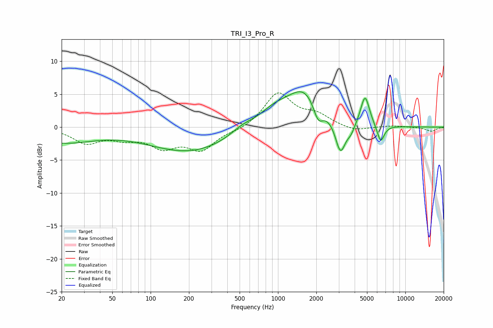

# TRI_I3_Pro_R
See [usage instructions](https://github.com/jaakkopasanen/AutoEq#usage) for more options and info.

### Parametric EQs
Apply preamp of -5.5 dB when using parametric equalizer.

|   # | Type    |   Fc (Hz) |    Q |   Gain (dB) |
|-----|---------|-----------|------|-------------|
|   1 | Peaking |        20 | 0.54 |        -2.2 |
|   2 | Peaking |       204 | 0.43 |        -3.7 |
|   3 | Peaking |       524 | 1.51 |         1   |
|   4 | Peaking |       940 | 1.1  |         2.3 |
|   5 | Peaking |      1624 | 1.07 |         5.3 |
|   6 | Peaking |      2068 | 3.61 |        -2.8 |
|   7 | Peaking |      3095 | 3.53 |        -5   |
|   8 | Peaking |      3739 | 4.59 |        -1.2 |
|   9 | Peaking |      4826 | 4.04 |         4.6 |
|  10 | Peaking |      6398 | 4.79 |        -2.7 |

### Fixed Band EQs
When using fixed band (also called graphic) equalizer, apply preamp of **-5.3 dB** (if available) and set gains manually with these parameters.

|   # | Type    |   Fc (Hz) |    Q |   Gain (dB) |
|-----|---------|-----------|------|-------------|
|   1 | Peaking |        31 | 1.41 |        -2.3 |
|   2 | Peaking |        62 | 1.41 |        -1.3 |
|   3 | Peaking |       125 | 1.41 |        -2.7 |
|   4 | Peaking |       250 | 1.41 |        -3.2 |
|   5 | Peaking |       500 | 1.41 |        -0.5 |
|   6 | Peaking |      1000 | 1.41 |         5.1 |
|   7 | Peaking |      2000 | 1.41 |         1.6 |
|   8 | Peaking |      4000 | 1.41 |        -0.7 |
|   9 | Peaking |      8000 | 1.41 |         0.2 |
|  10 | Peaking |     16000 | 1.41 |        -0.6 |

### Graphs

