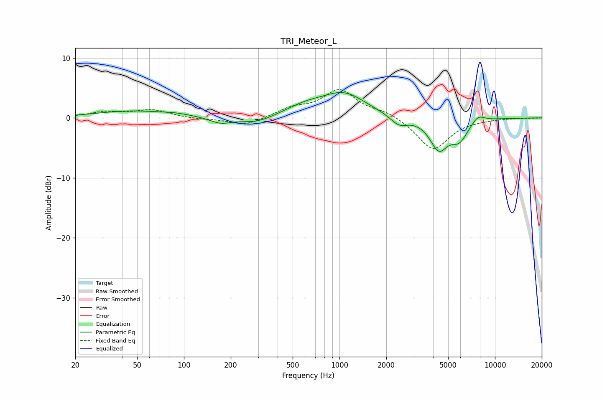

# TRI_Meteor_L
See [usage instructions](https://github.com/jaakkopasanen/AutoEq#usage) for more options and info.

### Parametric EQs
Apply preamp of -4.3 dB when using parametric equalizer.

|   # | Type    |   Fc (Hz) |    Q |   Gain (dB) |
|-----|---------|-----------|------|-------------|
|   1 | Peaking |        45 | 0.66 |         1.1 |
|   2 | Peaking |        88 | 1.37 |         0.4 |
|   3 | Peaking |       172 | 2.05 |        -1   |
|   4 | Peaking |       294 | 1.28 |        -1.1 |
|   5 | Peaking |       598 | 1.07 |         1.5 |
|   6 | Peaking |      1071 | 0.98 |         3.9 |
|   7 | Peaking |      2408 | 2.57 |        -1.6 |
|   8 | Peaking |      4353 | 2.41 |        -4.9 |
|   9 | Peaking |      5905 | 2.43 |        -3.2 |
|  10 | Peaking |      7785 | 3.12 |         1.3 |

### Fixed Band EQs
When using fixed band (also called graphic) equalizer, apply preamp of **-4.8 dB** (if available) and set gains manually with these parameters.

|   # | Type    |   Fc (Hz) |    Q |   Gain (dB) |
|-----|---------|-----------|------|-------------|
|   1 | Peaking |        31 | 1.41 |         0.9 |
|   2 | Peaking |        62 | 1.41 |         1.3 |
|   3 | Peaking |       125 | 1.41 |        -0.2 |
|   4 | Peaking |       250 | 1.41 |        -1.3 |
|   5 | Peaking |       500 | 1.41 |         1.4 |
|   6 | Peaking |      1000 | 1.41 |         4.5 |
|   7 | Peaking |      2000 | 1.41 |         1   |
|   8 | Peaking |      4000 | 1.41 |        -5.4 |
|   9 | Peaking |      8000 | 1.41 |        -0.1 |
|  10 | Peaking |     16000 | 1.41 |        -0   |

### Graphs

