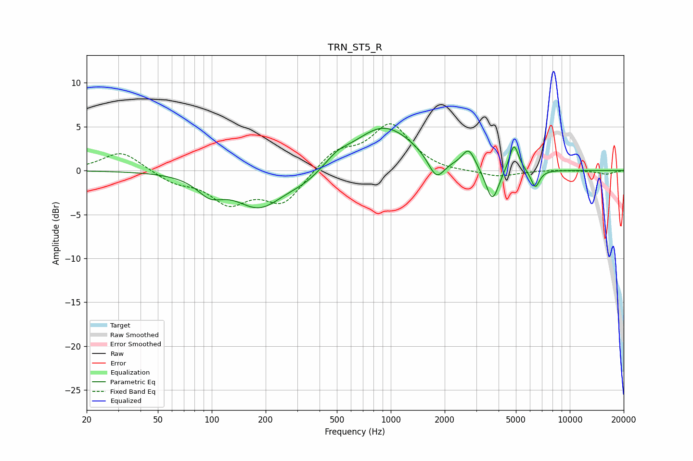

# TRN_ST5_R
See [usage instructions](https://github.com/jaakkopasanen/AutoEq#usage) for more options and info.

### Parametric EQs
Apply preamp of -4.9 dB when using parametric equalizer.

|   # | Type    |   Fc (Hz) |    Q |   Gain (dB) |
|-----|---------|-----------|------|-------------|
|   1 | Peaking |        98 | 1.93 |        -1.9 |
|   2 | Peaking |       185 | 1.04 |        -4.1 |
|   3 | Peaking |       330 | 1.34 |        -1.1 |
|   4 | Peaking |       502 | 2.3  |         0.8 |
|   5 | Peaking |       917 | 0.81 |         5.1 |
|   6 | Peaking |      1797 | 3.11 |        -2.6 |
|   7 | Peaking |      2725 | 3.95 |         2.1 |
|   8 | Peaking |      3691 | 3.85 |        -3.9 |
|   9 | Peaking |      4876 | 5.3  |         3.2 |
|  10 | Peaking |      6410 | 5.61 |        -2.1 |

### Fixed Band EQs
When using fixed band (also called graphic) equalizer, apply preamp of **-5.4 dB** (if available) and set gains manually with these parameters.

|   # | Type    |   Fc (Hz) |    Q |   Gain (dB) |
|-----|---------|-----------|------|-------------|
|   1 | Peaking |        31 | 1.41 |         2.3 |
|   2 | Peaking |        62 | 1.41 |        -1.2 |
|   3 | Peaking |       125 | 1.41 |        -3.4 |
|   4 | Peaking |       250 | 1.41 |        -3.6 |
|   5 | Peaking |       500 | 1.41 |         2.2 |
|   6 | Peaking |      1000 | 1.41 |         5.1 |
|   7 | Peaking |      2000 | 1.41 |        -0.3 |
|   8 | Peaking |      4000 | 1.41 |        -0.7 |
|   9 | Peaking |      8000 | 1.41 |         0.1 |
|  10 | Peaking |     16000 | 1.41 |        -0.4 |

### Graphs

