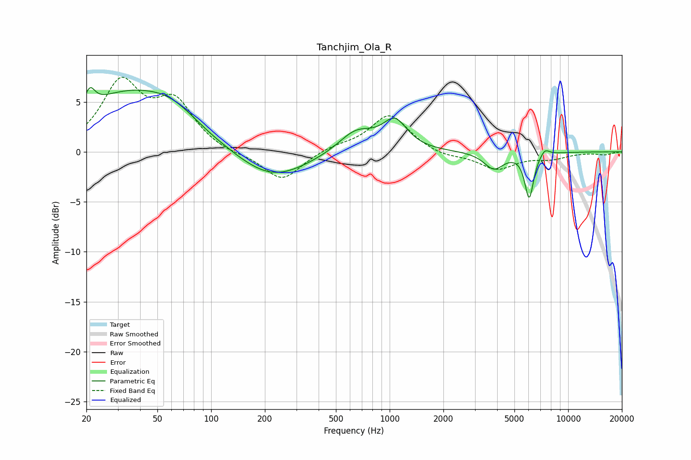

# Tanchjim_Ola_R
See [usage instructions](https://github.com/jaakkopasanen/AutoEq#usage) for more options and info.

### Parametric EQs
Apply preamp of -6.5 dB when using parametric equalizer.

|   # | Type    |   Fc (Hz) |    Q |   Gain (dB) |
|-----|---------|-----------|------|-------------|
|   1 | Peaking |        21 | 5.14 |         1.8 |
|   2 | Peaking |        33 | 0.5  |         5.5 |
|   3 | Peaking |        61 | 0.98 |         1.8 |
|   4 | Peaking |       122 | 5.9  |         0   |
|   5 | Peaking |       219 | 0.72 |        -2.9 |
|   6 | Peaking |       648 | 1.42 |         2.2 |
|   7 | Peaking |      1070 | 2.03 |         2.9 |
|   8 | Peaking |      3833 | 2.58 |        -1.7 |
|   9 | Peaking |      6050 | 5.64 |        -4.5 |
|  10 | Peaking |      7398 | 5.29 |         0.7 |

### Fixed Band EQs
When using fixed band (also called graphic) equalizer, apply preamp of **-7.6 dB** (if available) and set gains manually with these parameters.

|   # | Type    |   Fc (Hz) |    Q |   Gain (dB) |
|-----|---------|-----------|------|-------------|
|   1 | Peaking |        31 | 1.41 |         6.6 |
|   2 | Peaking |        62 | 1.41 |         4.5 |
|   3 | Peaking |       125 | 1.41 |        -0.3 |
|   4 | Peaking |       250 | 1.41 |        -2.9 |
|   5 | Peaking |       500 | 1.41 |         0.5 |
|   6 | Peaking |      1000 | 1.41 |         3.7 |
|   7 | Peaking |      2000 | 1.41 |        -0.5 |
|   8 | Peaking |      4000 | 1.41 |        -1.7 |
|   9 | Peaking |      8000 | 1.41 |        -0.6 |
|  10 | Peaking |     16000 | 1.41 |        -0.3 |

### Graphs

