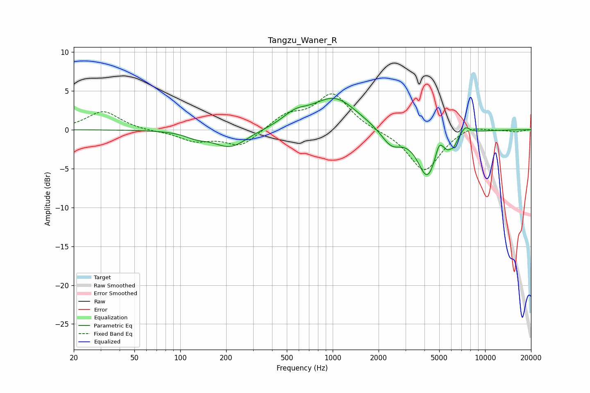

# Tangzu_Waner_R
See [usage instructions](https://github.com/jaakkopasanen/AutoEq#usage) for more options and info.

### Parametric EQs
Apply preamp of -4.1 dB when using parametric equalizer.

|   # | Type    |   Fc (Hz) |    Q |   Gain (dB) |
|-----|---------|-----------|------|-------------|
|   1 | Peaking |       127 | 2.01 |        -0.6 |
|   2 | Peaking |       213 | 1.28 |        -2.3 |
|   3 | Peaking |       565 | 1.74 |         1.3 |
|   4 | Peaking |      1028 | 0.95 |         4.1 |
|   5 | Peaking |      2423 | 2.09 |        -2.2 |
|   6 | Peaking |      4177 | 2.19 |        -5.9 |
|   7 | Peaking |      4982 | 5.99 |         1.6 |
|   8 | Peaking |      5680 | 6    |        -0.8 |
|   9 | Peaking |      6216 | 5.83 |        -1.1 |
|  10 | Peaking |      7428 | 4.58 |         1   |

### Fixed Band EQs
When using fixed band (also called graphic) equalizer, apply preamp of **-4.7 dB** (if available) and set gains manually with these parameters.

|   # | Type    |   Fc (Hz) |    Q |   Gain (dB) |
|-----|---------|-----------|------|-------------|
|   1 | Peaking |        31 | 1.41 |         2.4 |
|   2 | Peaking |        62 | 1.41 |        -0.2 |
|   3 | Peaking |       125 | 1.41 |        -1.3 |
|   4 | Peaking |       250 | 1.41 |        -2.1 |
|   5 | Peaking |       500 | 1.41 |         1.8 |
|   6 | Peaking |      1000 | 1.41 |         4.6 |
|   7 | Peaking |      2000 | 1.41 |        -0.1 |
|   8 | Peaking |      4000 | 1.41 |        -5.4 |
|   9 | Peaking |      8000 | 1.41 |         0.7 |
|  10 | Peaking |     16000 | 1.41 |        -0.3 |

### Graphs

